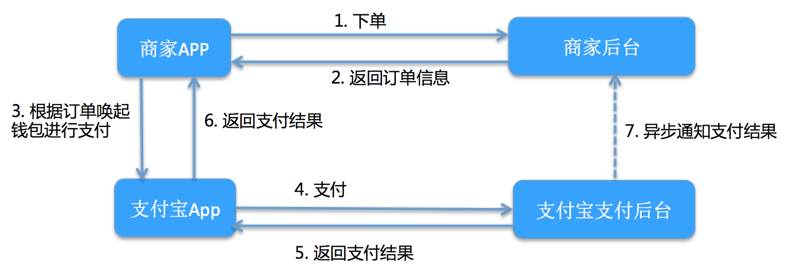
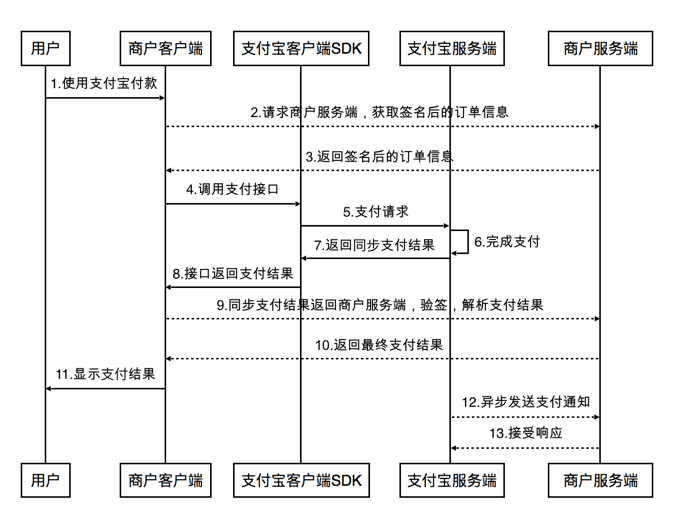
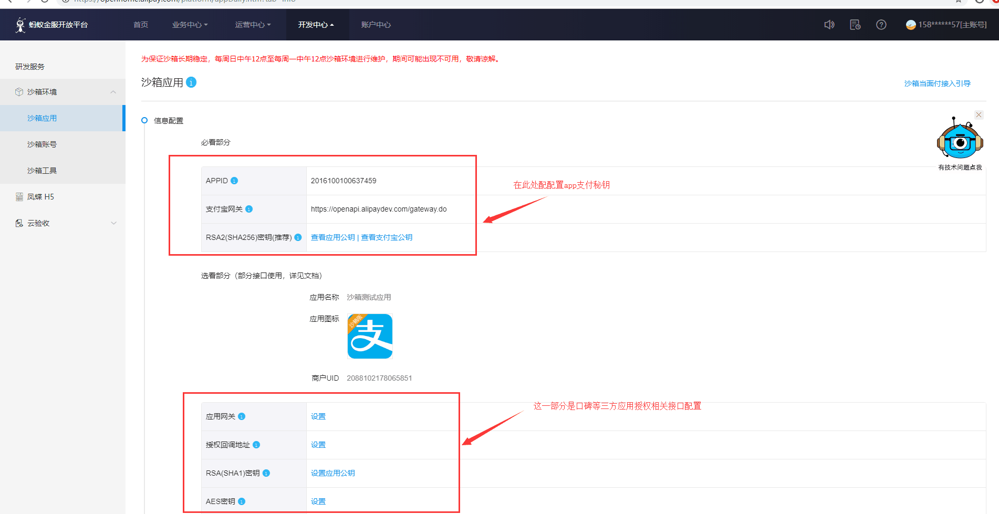
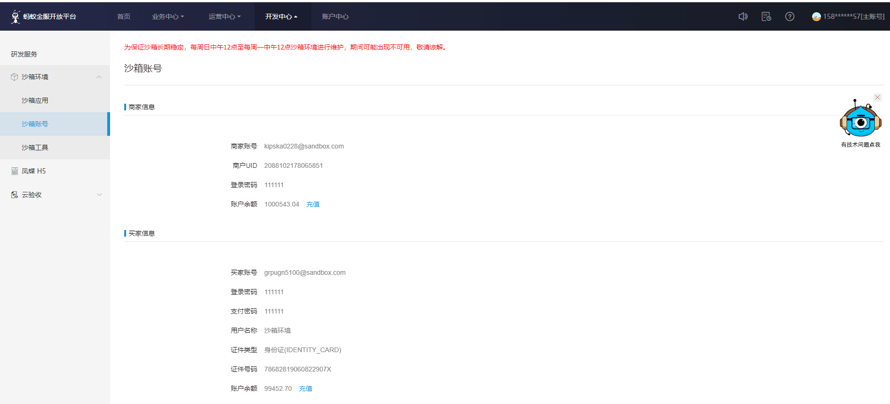
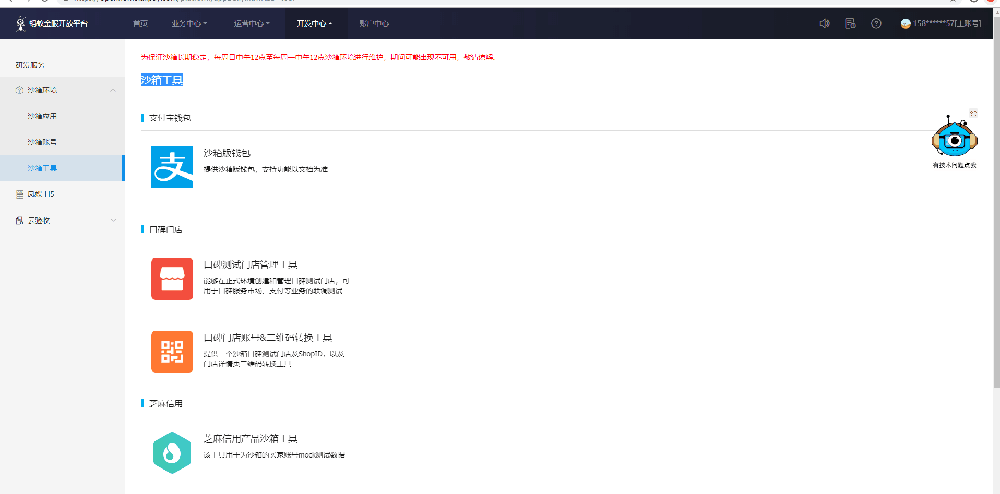

# 支付宝App支付
2019年05月21日 13:30:00 刘晓伟
## 一.支付对接流程
### 1.1 app支付整体流程图
  
 
  
 
 
### 1.2 app接入步骤

* 第一步 登录[支付宝开放平台](https://open.alipay.com/platform/home.htm),创建应用并获取APPID;(可使用支付宝沙箱环境进行集成测试)

* 第二步 下载[支付宝签名工具](https://docs.open.alipay.com/291/105971)，配置应用公私钥;

* 第三步 springboot集成[服务端sdk](https://docs.open.alipay.com/54)开发;

* 第四步 App客户端sdk加载服务端sdk生成的orderstring，自动唤起支付宝app客户端进行支付！

### 1.3 关于沙箱环境
 
 * 登录[支付宝开放平台](https://open.alipay.com/platform/home.htm)，创建沙箱环境应用并获取appid。
 
 * 配置沙箱环境公私钥  
 
 * 下载沙箱应用钱包，沙箱钱包仅支持扫码支付、付款码支付。
 
 * APP支付只支持 Android 版接入，在使用 SDK 时，在支付接口前调用如下方法: EnvUtils.setEnv(EnvUtils.EnvEnum.SANDBOX);
 
### 1.4 已配置好的沙箱环境配置如下图
   
 
        
 
         
       
         
## 二.SpringBoot集成app支付

### 2.1 服务端sdk 
```
 <dependency>
            <groupId>com.alipay.sdk</groupId>
            <artifactId>alipay-sdk-java</artifactId>
            <version>3.7.26.ALL</version>
  </dependency>
```
  
### 2.2 application.properties
  ```
alipay.app_id=2016100100637459
alipay.app_private_key=MIIEvQIBADANBgkqhkiG9w0BAQEFAASCBKcwggSjAgEAAoIBAQCICQ6YulEOVbK0fJvVAiUtqX7EXEEKkSOYRdPi0nNtEdFoZ66YsEb4pS1E+Sc7i6gHSBfOCZDjMATXYS7ZxFqS+5B2RdV/r8fIb6Des5cuXFcth8UA2bYi9S3EFZcR2+OaCW5iuu7V+0LMiUBrcYfSbJy5/yhf099U4669U32+PUMVLU+y9WkcHsqtUYm3twcHrc43IRCvy4DcUvVK4hVfLEHR5QHyLzHd1z0q3gqSY1EwqlyHXw0Y/MdSyD95BOClw/tvhMtwMClei+hMYyJvJJarA+Aj0UD+BSG1QNOyltbYSXp8G4svAeYpLWIJEjCPRjch3Enb/aZ43zYSD72ZAgMBAAECggEAd3gczZyzmvdAXqog4U1lAVkd761lobYdoJmSoF1a6asAUcTc3VPSwIOv4ic+gVkBVIPIBDb6e8usNMswrid3tCYilPx3qA/kUO9YRL1MRHbsSRw3s6t//et9KfwcFJ8coCcwPp0VK+/ilmbjoHiwY+jnK6Ie/ym/tXnP+I3enLc83d20FAvYmeqPGCZc3Vp/n6dxAfqD2c19tlyZpnL6cufnPN2z13AY6935V3hH+b97S8GjnDOq2MvMFuAG/b1HBiV+LGWrZUp6C0QiG+9iLwtykT3rUa+frmSFq+zd8pfSV77aYOMc1WkiVT6pmL8iXavF1KkxeCAt6EibcP8ZEQKBgQDaaFd2PjXzQwxw2fG0Z5QIVDPTdgkhzdRAwdbceca5TEDagwE/o3Veza67S4/RKkFszEN9Jm2MO/2dQxyOKtS/HkcmoIXHIOZSsZr0UC9PkPMbUdToEJMSf85JerWmi8KYBl8ZMpFag3PC4MTuNNqa0dVFvQ4/FpONFY6z784j1wKBgQCfcyl+7QAFuAlu00LYuvDs+KdKitBr5rXMUWDt8aBvYw8nmAab8bsM67n204nKzn0Repnvxi3x48gB0rL6j/qzOa8E8ZDDv90ncMv1bQvj9GPAyPbn7B/XXBboqnnEoTnP6RemTRdpDHTALKGafgPDOpya7QCK09qMo2xjfWz8DwKBgHsEBCc8eQSwQiSaDRKwuGdMjfhP5mrc1O04gL2j9XNO6MRqv1xJxAUG0qD5uWJ1a25NSsIFz/QJohpev4mvxC51blvqVA9Jj5EKKh3rwAoPuW4s1D91fnEP/W/TptbMp2kbRZsaqVYS7jPYh/MnX+2NvJNQHeMY4zi26K6epjv3AoGAW1a3AJR3HM+N58RxWIHOHZFbE6JtPkJNBhvf8K4nf2c5eS7nKlHRGte2EaSgHGMo1ehrYiUekKAxJIo0KMBtllmG3sgaa2fvIfbFf3PWCeEne3ojpjtnChEgtmthkbfhzC30dDlZHb4a6zMl58AkG6Pprf3x/5TYbxP2tQ9WbRUCgYEAvhOmjKmvwO1LIjbABsWeLBhlPGHCsDs/r55DtVfW+toDtI6BJbC9hrkxsZ11o1QouYLotz0ue19mbEJzGPhpaNWXhojInAzxe8qBVkEytlWJOQTXMFRpZM/+W+mbK5l0uWZ9lQjDcjCoixi/r8llvtnn9BLl4pSZX/5izUyShcQ=
alipay.alipay_public_key=MIIBIjANBgkqhkiG9w0BAQEFAAOCAQ8AMIIBCgKCAQEAg7lKA4J5ZMX9FfMFZiSc5y0/SNY6YblxIuxZrYID/YpmT43O6ANceFYMo+78/8cDkWqVU6mGYZAwOECbb/j1zWn9q/v2lVrYsCNPtQ8Nu1iI9fZeNlOoy8+aDFHG6Q1AOEU8dXirc/TNHoUc/2Y5kvBNIl/NKaVrO8DS7RNQ22Dqd3Mt/hpHKcPPrKztVC4A1Ua5QC8YRmRkHE7TxvosUBry22I1d6Sf+nhsfg0o8LeWk2hCxgnkXFsbPUzP7rHCN53EtXHj5YwLckBq1AmIZVibBDhlhiltmX15rUKsLG/eyrYeTO/bASFbNTS8FumOr2o99fBBO0pE1rl4YM4HqwIDAQAB
alipay.server_url=https://openapi.alipaydev.com/gateway.do
alipay.product_code=QUICK_MSECURITY_PAY
alipay.notify_url=http://liuxiaowei.free.idcfengye.com/api/alipay/noticeResponese
```  
 
### 2.3 封装AlipayUtil.java
```
import com.alibaba.fastjson.JSON;
import com.alipay.api.AlipayApiException;
import com.alipay.api.AlipayClient;
import com.alipay.api.DefaultAlipayClient;
import com.alipay.api.domain.AlipayTradePrecreateModel;
import com.alipay.api.domain.AlipayTradeQueryModel;
import com.alipay.api.internal.util.AlipaySignature;
import com.alipay.api.request.AlipayTradeAppPayRequest;
import com.alipay.api.request.AlipayTradePrecreateRequest;
import com.alipay.api.request.AlipayTradeQueryRequest;
import com.alipay.api.response.AlipayTradeAppPayResponse;
import com.alipay.api.response.AlipayTradePrecreateResponse;
import com.alipay.api.response.AlipayTradeQueryResponse;
import java.util.HashMap;
import java.util.Iterator;
import java.util.Map;
import javax.servlet.http.HttpServletRequest;
import lombok.extern.slf4j.Slf4j;
import org.springframework.beans.factory.annotation.Value;
import org.springframework.stereotype.Component;
import tk.mybatis.springboot.bo.AlipayQueryBo;
import tk.mybatis.springboot.facade.AlipayOrderFacade;

/**
 * 支付宝支付
 */
@Component
@Slf4j
public class AlipayUtil {

    //应用appid
    @Value("${alipay.app_id}")
    private String APP_ID;
    //app私钥
    @Value("${alipay.app_private_key}")
    private String APP_PRIVATE_KEY;
    //支付宝公钥
    @Value("${alipay.alipay_public_key}")
    private String ALIPAY_PUBLIC_KEY;
    //支付网关地址
    @Value("${alipay.server_url}")
    private String SERVER_URL;
    //签约产品码
    @Value("${alipay.product_code}")
    private String PRODUCT_CODE;
    //异步通知地址
    @Value("${alipay.notify_url}")
    private String NOTIFY_URL;

    //订单过期时间,取值范围：1m～15d。m-分钟，h-小时，d-天
    static String TIMEOUT_EXPRESS = "30m";
    static String CHARSET = "utf-8";

    static String PROJECT_NAME = "星动";

    /**
     * app支付
     */
    public String tradeAppPayRequest(AlipayOrderFacade facade)
        throws AlipayApiException {
        AlipayClient alipayClient = new DefaultAlipayClient(
            SERVER_URL, APP_ID, APP_PRIVATE_KEY,
            "json", CHARSET, ALIPAY_PUBLIC_KEY, "RSA2");
        AlipayTradeAppPayRequest request = new AlipayTradeAppPayRequest();
        request.setNotifyUrl(NOTIFY_URL);
        AlipayTradePrecreateModel model = new AlipayTradePrecreateModel();
        request.setBizModel(model);
        //商号订单号 最大64位 必填
        model.setOutTradeNo(facade.getOrderNo());
        //订单总金额，单位为元，精确到小数点后两位  必填
        model.setTotalAmount(facade.getPayAmount());
        //订单标题 必填
        model.setSubject(PROJECT_NAME + "-" + facade.getOrderName());
        //对交易或商品的描述
        model.setBody(facade.getOrderName());
        //该笔订单允许的最晚付款时间，逾期将关闭交易。取值范围：1m～15d。m-分钟，h-小时，d-天
        model.setTimeoutExpress(TIMEOUT_EXPRESS);
        model.setQrCodeTimeoutExpress(TIMEOUT_EXPRESS);
        //销售产品码，商家和支付宝签约的产品码，为固定值QUICK_MSECURITY_PAY 必填
        model.setProductCode(PRODUCT_CODE);
        log.info("支付宝app支付|创建支付订单信息:{}", JSON.toJSONString(request));
        AlipayTradeAppPayResponse response = alipayClient.sdkExecute(request);
        log.info("支付宝app支付|创建支付订单应答结果:{}", JSON.toJSONString(response));
        //返回数据
        if (response.isSuccess()) {
            // 获取到getBody直接给app,用这个东西去调起支付宝
            return response.getBody();
        } else {
            throw new AlipayApiException("支付宝app支付|创建支付订单信息失败！");
        }
    }

    /**
     * 扫码支付
     */
    public String tradeQrcodePayRequest(AlipayOrderFacade facade) throws AlipayApiException {
        AlipayClient alipayClient = new DefaultAlipayClient(SERVER_URL, APP_ID, APP_PRIVATE_KEY,
            "json", CHARSET, ALIPAY_PUBLIC_KEY, "RSA2");
        AlipayTradePrecreateRequest request = new AlipayTradePrecreateRequest();
        AlipayTradePrecreateModel model = new AlipayTradePrecreateModel();
        request.setBizModel(model);
        request.setNotifyUrl(NOTIFY_URL);
        //商号订单号 最大64位 必填
        model.setOutTradeNo(facade.getOrderNo());
        //订单总金额，单位为元，精确到小数点后两位  必填
        model.setTotalAmount(facade.getPayAmount());
        //订单标题 必填
        model.setSubject(PROJECT_NAME + "-" + facade.getOrderName());
        //对交易或商品的描述
        model.setBody(facade.getOrderName());
        //该笔订单允许的最晚付款时间，逾期将关闭交易。取值范围：1m～15d。m-分钟，h-小时，d-天
        model.setTimeoutExpress(TIMEOUT_EXPRESS);
        model.setQrCodeTimeoutExpress(TIMEOUT_EXPRESS);
        log.info("支付宝扫码支付|创建支付订单信息:{}", JSON.toJSONString(request));
        AlipayTradePrecreateResponse response = alipayClient.execute(request);
        log.info("支付宝扫码支付|创建支付订单应答结果:{}", JSON.toJSONString(response));
        //返回数据
        if (response.isSuccess()) {
            return response.getQrCode();
        } else {
            throw new AlipayApiException("支付宝扫码支付|创建支付订单信息失败！");
        }
    }

    /**
     * app支付：支付宝异步通知验签及解析
     */
    public Map<String, String> checkNoticeParam(HttpServletRequest request)
        throws AlipayApiException {
        //获取支付宝POST过来反馈信息
        Map<String, String> params = new HashMap<>();
        Map requestParams = request.getParameterMap();
        for (Iterator iter = requestParams.keySet().iterator(); iter.hasNext(); ) {
            String name = (String) iter.next();
            String[] values = (String[]) requestParams.get(name);
            String valueStr = "";
            for (int i = 0; i < values.length; i++) {
                valueStr = (i == values.length - 1) ? valueStr + values[i]
                    : valueStr + values[i] + ",";
            }
            //乱码解决，这段代码在出现乱码时使用。
            //valueStr = new String(valueStr.getBytes("ISO-8859-1"), "utf-8");
            params.put(name, valueStr);
        }
        log.info("支付宝异步通知|应答参数:{}", JSON.toJSONString(params));
        boolean flag = AlipaySignature.rsaCheckV1(params, ALIPAY_PUBLIC_KEY, CHARSET, "RSA2");
        log.info("支付宝异步通知|验签结果:flag={}", flag);
        if (flag) {
            return params;
        }
        return null;
    }

    /**
     * 交易查询接口
     */
    public AlipayQueryBo queryPayStatus(String orderNo) throws AlipayApiException {
        AlipayClient alipayClient = new DefaultAlipayClient(SERVER_URL, APP_ID, APP_PRIVATE_KEY,
            "json", CHARSET, ALIPAY_PUBLIC_KEY, "RSA2");
        AlipayTradeQueryRequest request = new AlipayTradeQueryRequest();
        AlipayTradeQueryModel model = new AlipayTradeQueryModel();
        request.setBizModel(model);
        model.setOutTradeNo(orderNo);
        log.info("支付宝交易查询接口|请求参数:{}", JSON.toJSONString(request));
        AlipayTradeQueryResponse response = alipayClient
            .execute(request);
        log.info("支付宝交易查询接口|应答结果:{}", JSON.toJSONString(response));
        //返回数据
        if (response.isSuccess()) {
            AlipayQueryBo bo = new AlipayQueryBo();
            bo.setTradeStatus(response.getTradeStatus());
            bo.setOutTradeNo(response.getOutTradeNo());
            bo.setTradeNo(response.getTradeNo());
            bo.setReceiptAmount(response.getReceiptAmount());
            return bo;
        }
        return null;
    }
}

```

### 2.4 生成支付订单
```
 public JSONObject generatePayOrderInfo(){
        String orderNo = OrderUtil.getOrderNo();
        AlipayOrderFacade alipayOrderFacade = new AlipayOrderFacade();
        alipayOrderFacade.setOrderNo(orderNo);
        alipayOrderFacade.setOrderName("星动-瞩目灯(5天)");
        alipayOrderFacade.setPayAmount("0.01");
        String orderString = alipayUtil.tradeAppPayRequest(alipayOrderFacade);
        if (StringUtils.isNotBlank(orderString)) {
           //TODO 记录支付订单信息（订单状态为：待支付）
        }
        // 返回数据
        JSONObject resjson = new JSONObject();
        resjson.put("orderNo",orderNo );  // 返回给App，支付订单号
        resjson.put("orderString", orderString); // 返回给App，让支付宝客户端sdk直接加载，唤起支付宝app!
        return resjson
 }

```


### 2.5 支付同步通知
 
 更新订单状态“待支付 -> 支付中 ”


### 2.6 异步通知处理
* 验证异步通知签名
* 支付金额等异步通知参数校验
* 更新支付订单状态“待支付或支付中 -> 支付成功 ”
* 处理其他业务

```
 public void noticeResponse(HttpServletRequest request, HttpServletResponse response)
        throws AlipayApiException, IOException {
        //1.异步通知验签并返回请求参数
        Map<String, String> resmap = alipayUtil.checkNoticeParam(request);
        if (null == resmap) {
            log.error("支付宝异步通知|验签失败!");
            return;
        }
        String orderNo = resmap.get("out_trade_no");
        String status = resmap.get("trade_status");
        String amount = resmap.get("receipt_amount");
        String thirdTradeNo = resmap.get("trade_no");
        log.info("支付宝异步通知|订单号:{},订单的状态:{},订单金额:{}", orderNo, status, amount);
        //交易完成
        if (AlipayNoticeTradeStatusEnum.TRADE_SUCCESS.getCode().equals(status)
            || AlipayNoticeTradeStatusEnum.TRADE_FINISHED.getCode().equals(status)) {
            PayOrderInfoDto payOrderInfoDto = payOrderInfoService.getPayOrderInfoByOrderNo(orderNo);
            //2. 异步通知参数校验
            if (null == payOrderInfoDto) {
                log.error("支付宝异步通知|未查询到支付订单记录! orderNo={}", orderNo);
                return;
            }
            if (!AmountUtil.decimalFormat(payOrderInfoDto.getRealAmount()).equals(amount)) {
                log.error("支付宝异步通知|订单金额不一致! orderNo={}", orderNo);
                return;
            }
            if (PayOrderStatusEnum.SUCCESS.getCode() == payOrderInfoDto.getPayStatus()
                || PayOrderStatusEnum.FAIL.getCode() == payOrderInfoDto.getPayStatus()) {
                log.info("支付宝异步通知|订单已处理! orderNo={}", orderNo);
                return;
            }
            //3.更新支付订单状态
            payOrderInfoDto.setThirdOrderNo(thirdTradeNo);
            Integer row = payOrderInfoService
                .updatePayOrderSuccess(payOrderInfoDto);
            if (row > 0) {
                //4.更新业务数据 TODO      
     
                //5.通知支付宝服务
                String message = "success";
                ServletOutputStream out = response.getOutputStream();
                out.write(message.getBytes());
                out.flush();
                out.close();
            }
        }
    }

```

## 三.其他
### 3.1 链接推荐
* [支付宝开放平台](https://open.alipay.com/platform/home.htm)
* [App支付指南](https://docs.open.alipay.com/204/105301/)
* [App支付sdk下载](https://docs.open.alipay.com/54)
* [支付宝沙箱环境指南](https://docs.open.alipay.com/200/105311)
* [支付宝签名工具下载](https://docs.open.alipay.com/291/105971)
* [支付宝应用网关和授权回调地址](https://blog.csdn.net/sinat_32575213/article/details/79713654)
* [内网穿透工具ngrock下载](http://www.ngrok.cc/)
* [生产环境联调日志排查](https://openmonitor.alipay.com/acceptance/cloudparse.htm)

### 3.2 工具类
* [订单号生成工具类](util/OrderUtil.java)
* [App支付工具类](util/AlipayUtil.java)


