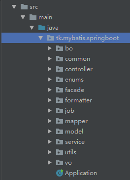
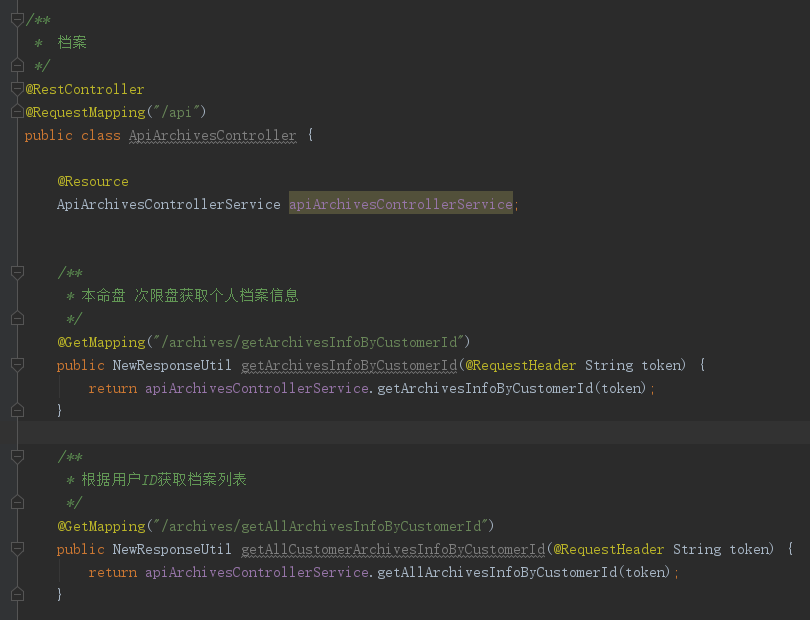
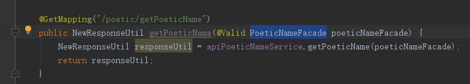
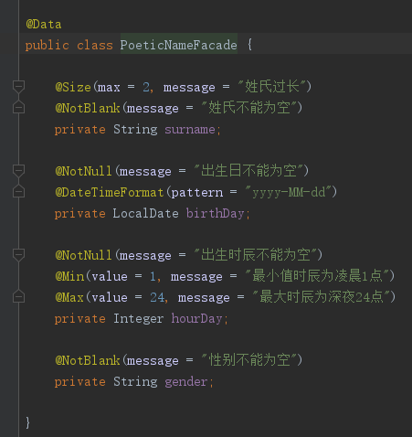
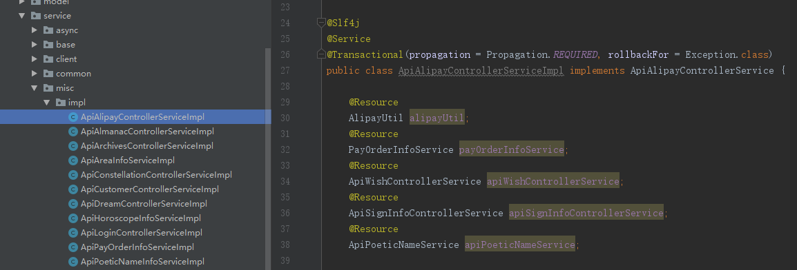
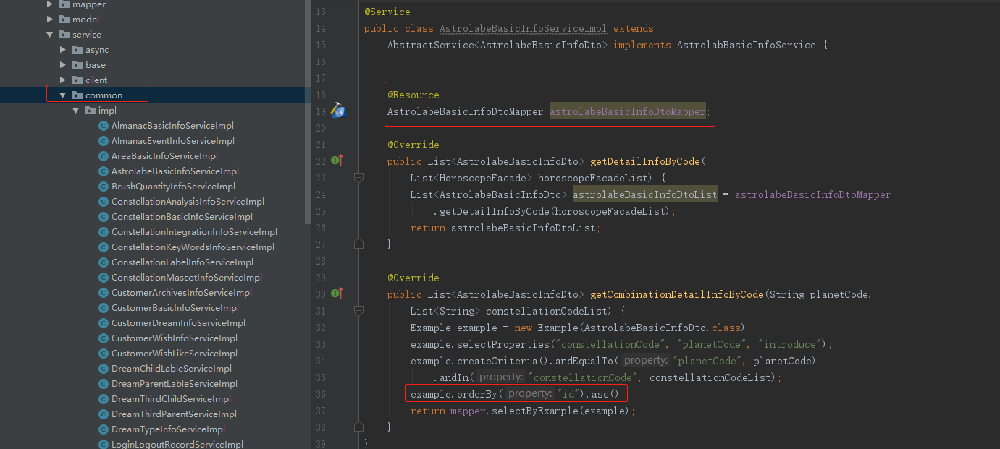
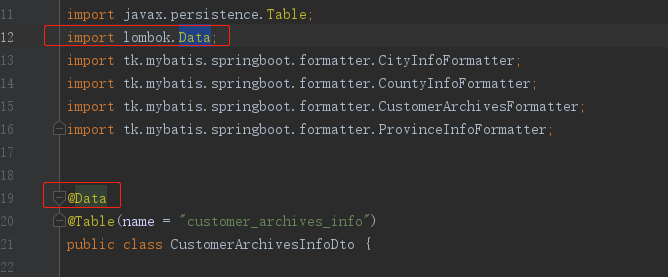
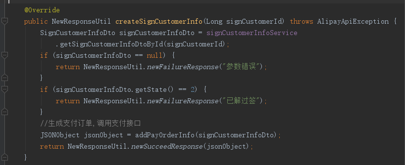

#项目代码规范
2019年05月22日 17:03:00 窦经纬

##一、命名规范
1. 【强制】包名全小写
2. 【强制】类名使用 UpperCamelCase 风格，类名首字母大写，如果类名由多个单词组成，每个单词的首字母都要大写
3. 【强制】变量名、方法名首字母小写，如果名称由多个单词组成，每个单词的首字母都要大写
4. 【强制】代码中的命名严禁使用拼音与英文混合的方式，更不允许直接使用中文的方式
5. 【强制】常量命名全部大写，单词间用下划线隔开，力求语义表达完整清楚，不要嫌名字长
6. 【推荐】为了达到代码自解释的目标，任何自定义编程元素在命名时，使用尽量完整的单词组合来表达其意
7. 【推荐】保证风格统一性，项目中所有命名禁止使用缩写
8. 【推荐】枚举类名建议带上 Enum 后缀，枚举成员名称需要全大写，单词间用下划线隔开
9. 【推荐】项目中Service层方法命名规约
    - 获取单个对象或多个对象的方法用 get 做前缀
    - 插入的方法用 save 做前缀
    - 删除的方法用 delete 做前缀
    - 修改的方法用 update 做前缀
    
    
    
##二、代码层次分明
### 1. src包 main\java\main\java\tk\mybatis\springboot


|包名|作用|
|---|:---|
|bo|(Business Object)业务对象|
|common|全局的(公共的)控制类|
|controller|控制器|
|enums|枚举类|
|facade|校验对象|
|formatter|格式化处理|
|job|定时任务|
|mapper|Mybatis接口|
|model|实体类|
|service|业务逻辑|
|utils|工具类|
|vo|视图对象|

### 2. resources包


|包名|作用|
|---|:---|
|generator|Mybatis自动生成插件|
|mapper|多表操作SQL|
|static|静态资源|

##三、代码规范
###1. 【强制】controller层只允许调用一个ApiService，且不允许做任何业务逻辑处理


###2. 【强制】使用@Valid注解及facade校验对象经行表单校验



###3. 【强制】所有的业务逻辑处理只允许在ApiService层(service/misc包下)，可以调用多个Service配合业务逻辑实现


###4. 【强制】每个Service(service/common包下)对应相应的model实体类，单表操作使用通用mapper，多表操作使用mapper.xml编写SQL，SQL主动加上ORDER BY


###5. 【推荐】model层Dto实体类采用[Lombok](https://www.cnblogs.com/heyonggang/p/8638374.html)插件使用@Data注解进行自动@ToString、@Getter、@Setter等操作


###6. 【强制】[Integer判断值相等](https://www.cnblogs.com/yecong/p/8316371.html)使用equals()

###7. 【推荐】保证代码健壮性，获取对象属性前先进行对象判空操作，判空后采用log日志输出



##四、SQL格式规范
###1. 【推荐】关键字统一使用大写，如SELECT、FROM、ORDER BY、GROUP BY 等
###2. 【推荐】关键字换行使用，SELECT与FROM单独占用一行
###3. 【推荐】函数统一使用大写，如COUNT()、MAX()、MIN()、RAND() 等
###4. 【强制】SQL必须要走SQL优化工具
```)
     SELECT
     id,type_code,title
     FROM
     (
     SELECT
     id,type_code,title,@rank:=@rank + 1,@rank:=0
     FROM
     quizzes_question_info
     ORDER BY RAND()
     ) t
     GROUP BY type_code
 ```
 