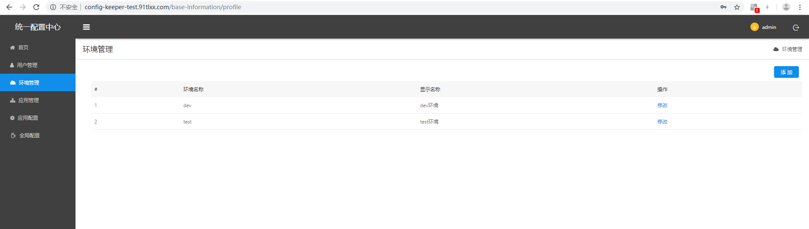
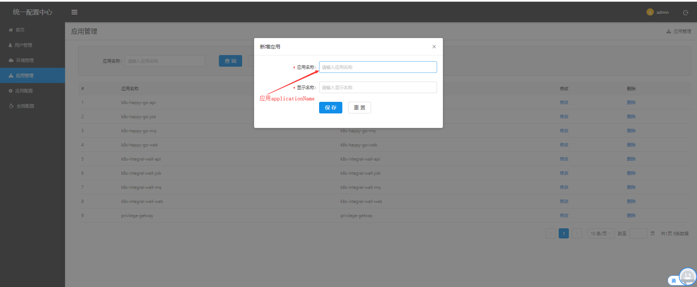
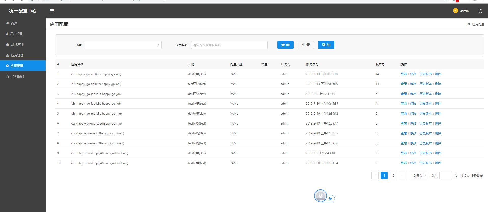
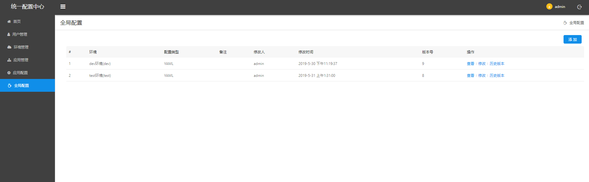
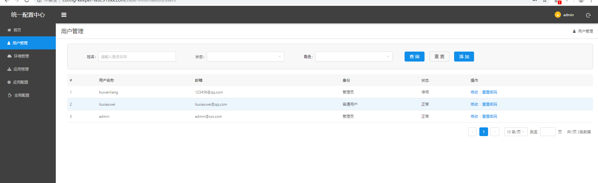

# Config-Keeper简介及使用
2019年09月18日 15:30:00 刘晓伟

## 一.分布式配置中心 Config-Keeper

### 1.1 Config-Keeper是一个轻量级分布式配置中心

官方文档: https://gitee.com/sxfad/config-keeper

### 1.2 客户端接入分布式配置中心步骤

* 引入maven依赖

```
    <dependency>
      <groupId>com.suixingpay.config-keeper</groupId>
      <artifactId>suixingpay-config-client</artifactId>
      <version>2.0.0</version>
    </dependency>

```

* yml文件增加配置（必须为bootstrap.yml文件)

```
suixingpay:
  config:
    enabled: true
    uris:
      - http://config-keeper-test.91tlxx.com
    cachePath: ./config
    cacheTimeOut: 0
    failFast: false

```

* 读取远程配置中心配置。

```

 @Value("${alipay.app_id:}")
 private String appId;

```

### 1.4 分布式配置中心配置使用步骤

* 配置环境



* 配置应用



* 给每个应用单独配置所需的配置



* 全局配置（所有应用共同配置）



* 创建用户，授权用户管理应用及配置



### 1.5 分布式配置中心配置改造

1. 引入jasypt-spring-boot-starter对敏感配置加密
 
    * 引入maven依赖
   
     ```
        <dependency>
                   <groupId>com.github.ulisesbocchio</groupId>
                   <artifactId>jasypt-spring-boot-starter</artifactId>
                   <version>2.1.1</version>
         </dependency>
     
     ```
    
    * yml文件增加配置
     
      ```
      jasypt:
             encryptor:
               password: salt123456  加密算法需要的盐值
               
      ```
      
    * 对配置加密
    
    ```
      public static void main(String[] args) {
              BasicTextEncryptor textEncryptor = new BasicTextEncryptor();
              //加密所需的salt(盐)
              textEncryptor.setPassword("salt123456");
              //要加密的数据（数据库的用户名或密码）
              String encryptStr = textEncryptor.encrypt("root");
              System.err.println("encryptStr:"+encryptStr);
              String decryptStr = textEncryptor.decrypt(encryptStr);
              System.err.println("decryptStr:"+decryptStr);
          }
          
      encryptStr字符串,在配置中心页面可以直接使用 ENC() 函数处理。
      示例： 
           初始配置: alipay.app_id=10000 
           加密配置: alipay.app_id=ENC(encryptStr)            
    ```
    
      
     


