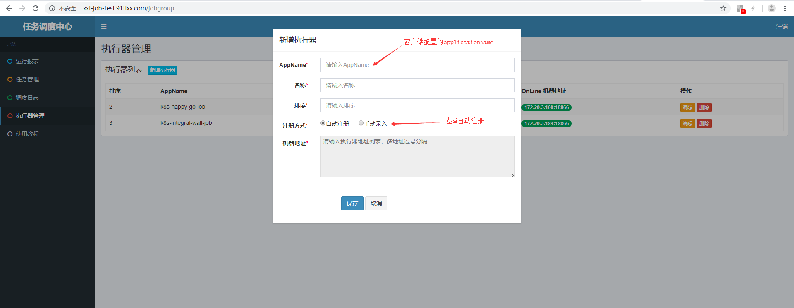
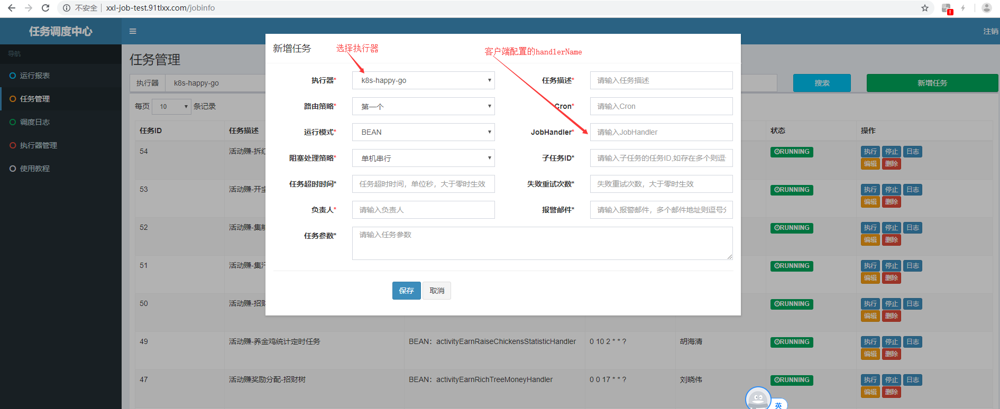

# XXL-JOB简介及使用
2019年09月18日 10:30:00 刘晓伟

## 一.定时任务管理平台 XXL-JOB

### 1.1 XXL-JOB是一个轻量级分布式任务调度平台

官方文档: http://www.xuxueli.com/xxl-job/#/

### 1.2 客户端接入任务管理平台步骤

* 引入maven依赖

```
    <dependency>
      <groupId>com.xuxueli</groupId>
      <artifactId>xxl-job-core</artifactId>
      <version>2.0.2</version>
    </dependency>

```

* yml文件增加配置

```
xxl:
  job:
    admin.addresses: xxl-job-test.91tlxx.com
    accessToken:
    executor:
      appname: ${spring.application.name}
      port: 18866
      appAddr:
      logpath: /data/applogs/xxl-job/applogs/jobhandler
      logretentiondays: -1
      ip:
      enable: false

```

* 继承IJobHandler,实现自己的业务handler. （示例如下)

```
@Component
@Slf4j
@JobHandler(value = "bigTurntableHandler")       任务管理平台新增任务配置时，将使用到。
public class BigTurntableHandler extends IJobHandler {

    @Resource
    JobActivityStatisticsService jobActivityStatisticsService;

    @Override
    public ReturnT<String> execute(String s) throws Exception {
        log.info("大转盘统计定时任务开始执行,执行时间----》{}", LocalDateTime.now());
        jobActivityStatisticsService.statisticsBigTurntable();
        return ReturnT.SUCCESS;
    }
}

```

### 1.3 任务管理平台配置业务handler及crontab表达式

* 新增执行器配置



* 新增任务配置




