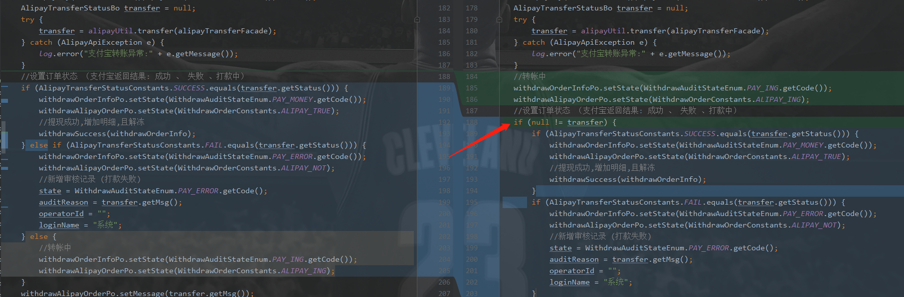
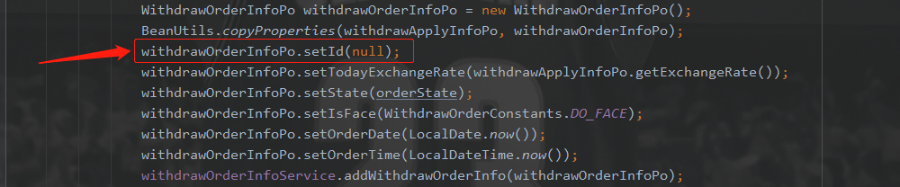

# 乐走bug分享

## 一、刘晓伟  2019年10月08日 13:30:00

### 1.1 bug1: rabbitmq消息延迟发送

* 在同一个ttl队列上，发送过期时间为2分钟、5分钟、10分钟的消息。消息未按照设置的时间发送。解决方法：每一个指定了过期时间的消息,配置一个单独ttl队列。
* 配置ttl队列时，@Bean注解错误使用。

### 1.2 bug2: java输出图片流

* 在输出gif文件时，动态图片显示不出动态效果。问题原因：Java只输出了gif图片的第一帧，所以显示不了动态效果。

## 二、窦经纬  2019年10月9日 12:00:00

### 1.1 bug1: 第三方接口调用

* 调用第三方支付宝打款接口，欠缺考虑调用第三方接口调用失败后对程序的影响。

### 1.2 bug2: 主键冲突

* 提现订单有两处生成web端订单方法，数据库主键id为自增长，在异步通知处的add方法，
  由于查询出的对象里带有id属性,使用BeanUtils.copyProperties方法给予对象赋值，
  导致add时使用了查询出的id值,使生成订单的id冲突。
  

## 三、胡海清  2019年x月x日 00:00:00

## 四、胡文亮  2019年x月x日 00:00:00