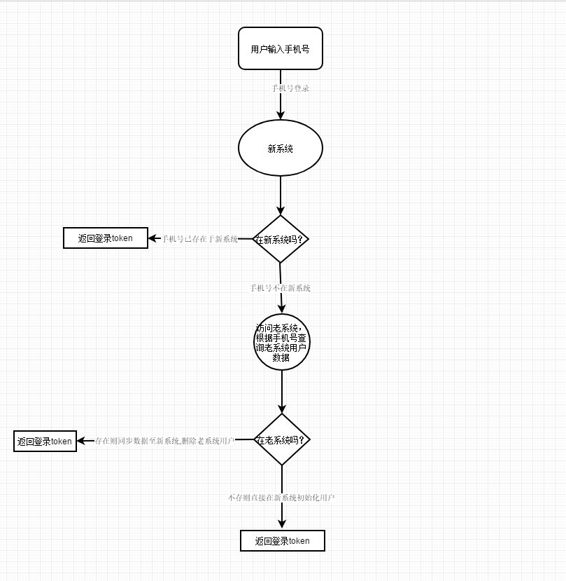
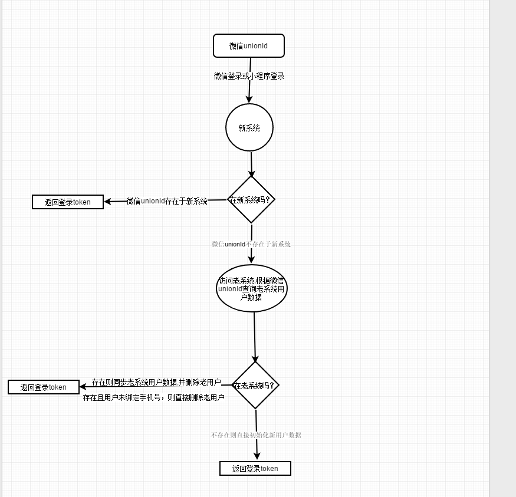

# 乐走登录流程
2019年07月08日 13:30:00 刘晓伟

## 一.业务简介
新乐走系统登录流程涉及业务接口：登录短信验证码发送、短信登录、微信登录、小程序登录、小程序绑定手机号登录，微信绑定，邀请好友以及老系统用户数据迁移。

## 二、老系统数据迁移流程

### 2.1 迁移的数据

* 用户持有的乐币余额
* 晨起打卡报名费
* 用户昵称、头像、性别、微信unionId、微信appId、微信wechatId

### 2.2 根据手机号迁移老系统用户数据流程\

### 2.3 根据微信unionId迁移老系统用户数据流程

## 三、登录流程涉及接口源码源码分析

### 3.1 登录短信验证码发送接口分析

* [源码地址](./source/ApiCustomerLoginServiceImpl.java)public NewResponseUtil sendPhoneData(ApiPhoneDataFacade facade);
* 白名单手机号码，直接生成模拟短信验证码，返回成功;
* 非白名单手机号码，每日发放短信验证码次数上线为5个;
* 若用户微信登录或小程序登录，且用户未绑定手机号，会强制走手机号登录流程（接收微信关联信息），进行手机号是否已绑定校验;
* 非白名单手机号码，校验都通过了，则调用三方接口进行短信验证码发送
* 短信验证码有效期30分钟;

### 3.2 短信登录接口分析

* [源码地址](./source/ApiCustomerLoginServiceImpl.java)public NewResponseUtil smsLogin(String deviceType, ApiSmsFacade facade);
* 进行短信验证码校验;
* 若用户微信登录或小程序登录，且用户未绑定手机号，会强制走手机号登录流程（接收微信关联信息），进行手机号是否已绑定校验;
* 新用户输入的邀请码校验;
* 手机号码未存在新系统:(1)判断手机号是否在老系统中，存在则同步老系统用户数据到新系统并删除老用户，不存在则直接初始化新用户数据;
  (2)生成新的token并存入login_logout_record表中,返回登录token给前端;
* 手机号码存在于新系统: (1)判断接收到的微信关联信息是否存在，存在则更新用户微信数据(customer_common_info表sessionKey;
customer_basic_info表微信unionId等数据);
  (2) 查询login_logout_record表token，token存在则直接返回给前端，否在生成新的token并存入login_logout_record表中,返回登录token给前端;
* token有效期为一年;

### 3.3 微信登录接口分析

* [源码地址](./source/ApiCustomerLoginServiceImpl.java)public NewResponseUtil accessUnionId(String appId, ApiUnionIdAppFacade unionIdAppFacade);
* 获取微信授权数据;
* 微信unionId在新系统中,判断用户wechat_id是否存在，不存在则更新用户微信数据,查询用户token，未过期则直接返回token给前端，否则生成新的token并存入login_logout_record表，并返回给前端;
* 微信unionId不在新系统中，根据微信unionId同步老用户数据至新系系统：(1)用户在老系统，且绑定了手机号，则同步老系统数据，然后删除老用户，生成token返回给前端;
(2)用户在老系统，且未绑定手机号，则直接删除老用户无需同步数据，并走强制绑定手机号登录流程（返回微信关联信息）；
(3)用户不在老系统，则直接走强制绑定手机号登录流程（返回微信关联信息）；

### 3.4 小程序登录接口分析

* [源码地址](./source/ApiCustomerLoginServiceImpl.java)public NewResponseUtil accessUnionId(ApiUnionIdProgramFacade unionIdProgramFacade);
* 获取微信授权数据;
* 微信unionId在新系统中,判断用户appId是否存在，不存在则更新用户微信数据,查询用户token，未过期则直接返回token给前端，否则生成新的token并存入login_logout_record表，并返回给前端;
* 微信unionId不在新系统中，根据微信unionId同步老用户数据至新系系统：根据微信unionId同步老用户数据至新系系统：(1)用户在老系统，且绑定了手机号，则同步老系统数据，然后删除老用户，生成token返回给前端;
 (2)用户在老系统，且未绑定手机号，则直接删除老用户无需同步数据，并走强制绑定手机号登录流程（返回微信关联信息）；
 (3)用户不在老系统，则直接走强制绑定手机号登录流程（返回微信关联信息）；
 
### 3.5 小程序绑定手机号登录接口分析

* [源码地址](./source/ApiCustomerLoginServiceImpl.java)public NewResponseUtil accessUnionIdBindPhone(ApiUnionIdProgramBindPhoneFacade unionIdProgramFacade);
* 获取微信授权数据；
* 解析到微信手机号，返回给前端，并强制走手机号登录流程;

### 3.6 微信绑定手机号接口分析

* [源码地址](./source/ApiCustomerBasicInfoServiceImpl.java) public NewResponseUtil bindUnionId(String customerId, String appId,ApiUnionIdAppFacade unionIdAppFacade);
* 获取微信授权数据;
* 更新用户微信数据;

