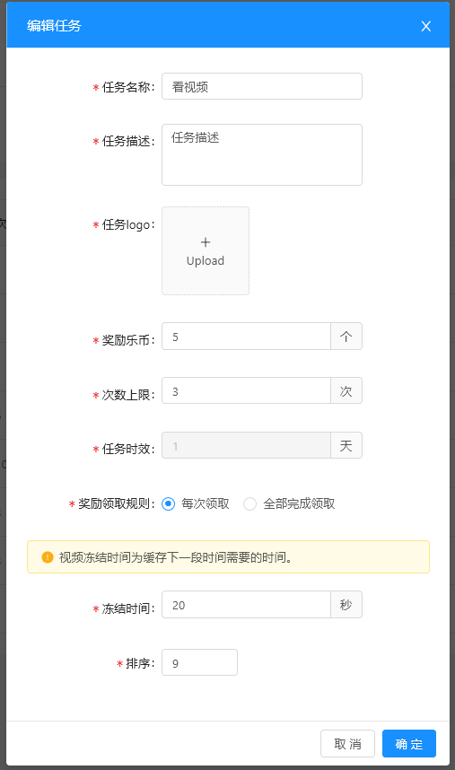
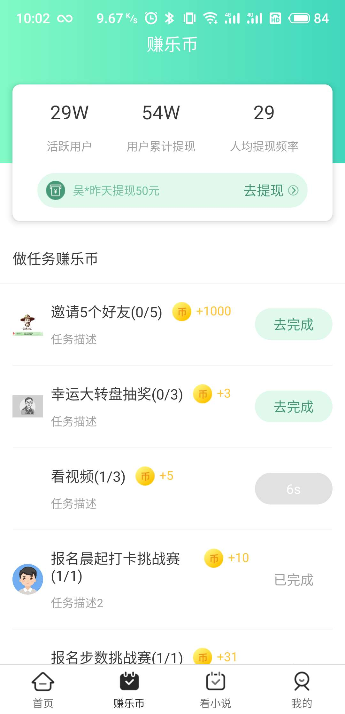

#任务流程及开发思路
2019年07月05日 10:15:15 窦经纬

##一、任务流程






###1.任务配置
+ 奖励乐币
  + 点击领取奖励所领取的乐币数量
+ 次数上限
  + 在任务时效内（有效期内）允许完成的次数上限
+ 每次领取
  + 完成一次任务领取一次任务奖励，直至任务上限为止
+ 全部完成领取
  + 任务完成次数到达任务上限次数时，才能领取任务奖励
+ 冻结时间
  + 多次任务且每次领取的前提下，完成一次任务，领取一次奖励后，在冻结时间内不可开始做下次任务

###2.任务类型
+ 单次任务
 
|类型|描述|
|---|:---|
|单日单次|(一天只能完成一次)|
|多日单次|全局的(公共的)控制类|

+ 多次任务

|类型|描述|
|---|:---|
|单日多次|(一天可以完成多次)|
|多日多次|(多天可以完成多次，任意哪天完成)|


###3.需求分析
+ 任务类型分为四种，需要同时满足
+ 当用户看了自己的任务列表之后，管理员修改任务配置不再影响用户有效期内的任务

    
##二、实现设计
### 1.数据库设计

```)
CREATE TABLE `task_record_info` (
 `id` bigint(20) unsigned NOT NULL AUTO_INCREMENT COMMENT 'id',
 `customer_id` varchar(32) NOT NULL DEFAULT '' COMMENT '用户ID',
 `task_id` bigint(20) NOT NULL DEFAULT '0' COMMENT '任务配置ID',
 `task_code` varchar(50) NOT NULL DEFAULT '' COMMENT '任务code',
 `begin_date` date NOT NULL DEFAULT '1970-01-01' COMMENT '任务有效期开始',
 `end_date` date NOT NULL DEFAULT '1970-01-01' COMMENT '任务有效期截至',
 `state` int(1) unsigned NOT NULL DEFAULT '1' COMMENT '乐币领取状态 1未完成 2待领取 3已领取',
 `wait_time` datetime NOT NULL DEFAULT '1970-01-01 00:00:00' COMMENT '任务等待时间',
 `exec_date` date NOT NULL DEFAULT '1970-01-01' COMMENT '任务完成日期',
 `exec_time` datetime NOT NULL DEFAULT '1970-01-01 00:00:00' COMMENT '任务完成时间',
 PRIMARY KEY (`id`),
) ENGINE=InnoDB AUTO_INCREMENT=441 DEFAULT CHARSET=utf8 COMMENT='用户任务单';
 ```
### 2.代码设计
#### 用户任务列表
  + 任务列表分为两处（任务列表、签到页任务列表）任务配置表字段标识即可
  + 当用户查看任务后，管理员修改任务配置信息，不允许改动用户已加载的任务信息，则用户查看列表后需要初始化自己的任务列表，存入当时任务ID
  + 初始化操作
    + 获取任务配置表已有任务
    + 需要过滤任务列表有效期内的任务，避免任务被覆盖
      + 当日从别的入口完成的任务
      + 多日任务
    + 插入过滤后任务配置表的任务
      + 任务有效期：开始日期为当天，截至日期为当天+任务时效天数-1
      + 状态：待完成
      + 任务等待时间为当前时间
  + 展示用户任务列表
    + 判断是否需要做初始化操作
    + 查询所有有效期内的任务
    + 判断任务展示的状态
      + 单次任务
        + 当前什么状态就展示什么状态
      + 多次任务
        + 每次领取
          + 含有一个待领取，展示待领取
          + 全部为已完成，展示已完成
          + 无待领取，有去完成，展示去完成
        + 全部完成领取
          + 含有一个去完成，展示去完成
          + 全都为待领取，展示待领取
          + 没有去完成，没有待领取，展示已完成
    + 判断任务冷却时间（获取任务等待时间，计算与当前时间相差的秒数）
    + 拼接任务路由（路由存放任务路由表，大转盘单独拼接当前用户ID）
    + 排序（按照：去完成>待领取>已完成）

#### 做任务
  + 任务入口可从任务列表进入，也可从其他入口例如（banner位推荐，活动等）
  + 完成任务时需要判断，有效期内是否含有此项任务且为待完成状态
    + 非任务列表进入时，可能存在任务未初始化的情况，不存在则去任务配置表查询是否存在，任务配置表存在则算完成
    + 从任务列表进入时，任务有做初始化操作，直接查看是否含有待完成状态即可
  + 单次任务，有效期内含有待完成的状态可直接修改状态为待领取奖励
  + 多次任务，先判断有效期内是否含有此项任务且为待完成状态，然后判断领取奖励模式(每次领取、全部完成领取)，最后判断任务上限是否达到，未达到次数上限则需要新增一条待完成的任务
  + 完成任务，设置当前任务有效期开始日期为当前时间，结束时间为当前时间加任务时效天数
  + 新增待完成任务逻辑与初始化任务一直，额外增加等待时间，设置等待时间为当前时间加冷却时间的秒数
  
#### 领取奖励
  + 判断当前任务有效期内是否含有待领取的状态，无匹配数据则直接返回乐币领取失败
  + 根据当前任务ID获取在配置表配置的奖励乐币个数
  + 修改有效期内当前任务所有待领取的任务状态为已完成
  + 根据修改影响行数插入钱包明细
  + 修改钱包统计表用户当前余额及累计赚取乐币总数
  