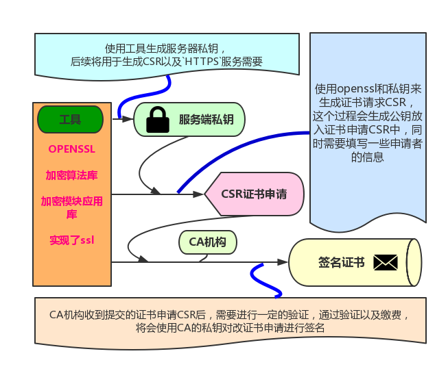
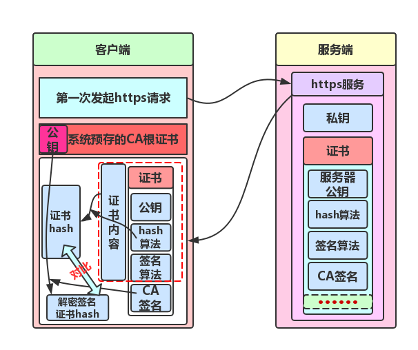
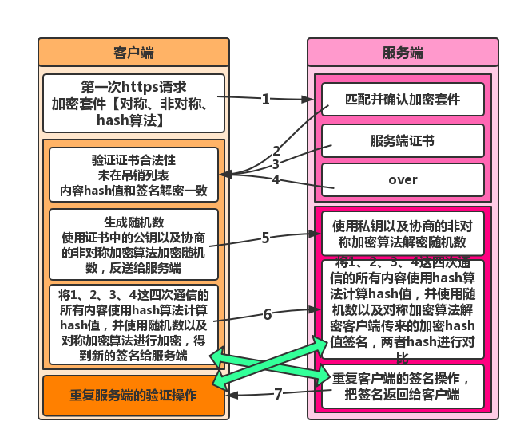

# https服务的原理和实现
2019年08月05日 18:30:00 胡海清

## https详解
目前大部分大型网站已经全部切换到了https服务，所以很有必要了解整个https的原理，https是如何保证信息安全的。这里希望大家对以下部分名词有一定的了解：
* 数字证书
是互联网通信中的身份标识(主要是用户身份信息和公钥)，一般由CA中心颁发，既CA认证中心，或第三方权威机构。数字证书上通常包括：CA的签名，证书所有人的公钥，CA中心的签名算法，指纹以及指纹算法，证书的唯一编号，版本，有效期等。
* 数字签名、签名算法
对信息的摘要【通过<strong>hash算法</strong>/<strong>摘要算法</strong>/<strong>指纹算法</strong>计算的信息<strong>摘要/hash值</strong>】使用签名算法进行加密，得到的密文就叫做数字签名
* 指纹、指纹算法/摘要算法【hash值计算】
对消息使用<strong>hash算法</strong>/<strong>摘要算法</strong>进行单向处理，获取一个固定长度的信息的<strong>摘要</strong>/<strong>hash值</strong>。
* 非对称加密
可以使用公钥、私钥分解进行对应的加密、解密的算法，即加解密使用的是不同的一堆秘钥。
* 对称加密
使用相同秘钥进行加解密的算法
* 公钥、私钥
非对称加解密的一对秘钥。

### https服务部署过程和原理

了解https的原理，最好的方法就是走一遍流程，理论上的流程和原理通过以下几点来解释：

1. 证书申请
2. 证书信任
3. 密文通信

#### 证书的获取

<strong>https</strong>的关键之一就是<strong>ssl</strong>证书，为了保证证书的安全有效性，在各类委员会/厂商之间合作，通过类似圆桌会议来形成若干权威的认证机构【顶级认证机构可以有若干附属的二级、三级...认证机构】，
想要得到受信任的证书，就需要向CA机构提交证书签名请求 (CSR, Certificate Signing Request)。过程如下：

1. 证书申请者【一般是公司、个人开发者等】需要使用加密算法【大部分是RSA算法】来生成私钥，其中私钥保存在服务器上，不提供给任何人。

2. 使用私钥生成证书签名请求 (CSR, Certificate Signing Request)【CSR中附带有公钥】，需要提供一些申请者相关的信息【域名、拥有者等信息】，
发送给CA机构请求他们的签名，经过他们签名才能成为被信任的证书。

3. CA机构对申请者进行验证【这里不同类型收费不同，验证方式也会不同】，验证通过后，将会在证书中添加部分信息【证书颁发机构、有效期、指纹/hash算法、签名算法】，
形成新的证书。【CA机构也是使用其自身的私钥来签名其他证书的】

4. 对新的证书进行签名，步骤如下：
  * 对新证书按照<strong>指纹</strong>/<strong>hash算法</strong>进行hash值计算
  * 使用CA机构的私钥对计算出来的hash值按照签名算法进行加密，得出的密文就是数字签名；
  * 将数字签名放在证书的最后面【签名完成】，得到完整的证书，并返回给申请者；
  * 申请者获取签名证书，保证自己的<strong>HTTPS</strong>服务被信任。
  
  
  
所以最后的证书基本包括但不限于的内容如下：

* 证书的有效期
* 公钥
* 证书所有者（Subject）
* 签名所使用的算法
* 指纹以及指纹算法【hash算法】
* Version Number，版本号。
* Serial Number，序列号。
* 颁发机构
* 数字签名

#### 客户端识别证书

在申请到受信任的证书后，客户端是怎么知道这些证书是值得信任的呢，不同浏览器和系统的具体实现不太一样，但是基本的方式差不多，
都是在系统或者浏览器中事先准备好权威的CA机构的相关信息[公钥、常使用的各类hash、签名、加密算法等]。具体过程如下：

1. 浏览器访问某https服务，带上浏览器自身支持的一系列Cipher Suite（密钥算法套件，后文简称Cipher）[C1,C2,C3, …]发给服务器【算法套件包括<strong>非对称算法</strong>、<strong>对称算法</strong>、<strong>hash算法</strong>】；
2. 服务器接收到浏览器的所有Cipher后，与自己支持的套件作对比，如果找到双方都支持的Cipher【双方套件中都能支持的最优先算法】，则告知浏览器，并返回自己的证书；
3. 浏览器确认和服务端后续的密文通信的加密算法，同时对证书进行认证；
4. 使用证书中的认证机构【可能是二级、三级机构】的公钥【系统、浏览器事先准备好的】按照证书中的签名算法进行解密【认证机构使用私钥加密的密文只能通过该认证机构的公钥进行解密】，解密获取hash值；
5. 使用证书中的<strong>hash</strong>/<strong>摘要算法</strong>对证书信息【证书签名除外的信息[服务器公钥、有效期等]】hash值计算，和4中解密的hash值进行对比，如果相等，表示证书值得信任；【通过数字签名来保证证书内容没有被篡改】。



#### https的加密通信过程

在上文的流程之后【证书信任，客户端和服务端握手中需要的<strong>非对称算法</strong>、<strong>握手信息验证的hash算法</strong>、<strong>正文传输的对称加密</strong>】，就是具体的通信过程：

1. 客户端信任了服务端的证书，并和服务端确认了双方的加密算法【握手中需要的<strong>非对称算法</strong>、<strong>握手信息验证的hash算法</strong>、<strong>正文传输的对称加密</strong>】；
2. 客户端生成<strong>随机数</strong>，通过证书中的公钥按照约定的非对称加密算法进行加密，得到加密的<strong>随机数秘钥</strong>，同时将之前所有的通信信息【秘钥算法套件、证书等所有的通信内容】按照约定的<strong>hash</strong>/<strong>摘要算法</strong>获取hash值，并使用随机数和协商好的对称加密算法进行签名加密，将<strong>随机数秘钥</strong>和<strong>加密签名</strong>发送到服务端。
3. 服务端收到<strong>随机数秘钥</strong>和<strong>加密签名</strong>，先使用私钥将<strong>随机数</strong>按照约定的非对称解密算法进行解密，获取随机数，同时使用随机数按照约定的对称解密算法进行解密，获取<strong>待验证的hash值</strong>，将之前的通信消息体【秘钥算法套件、证书等所有的通信内容】按照约定的<strong>hash/摘要算法</strong>获取hash值，与刚才解密获取的<strong>待验证的hash值</strong>对比，验证加密成功与否。
4. 成功以后，服务器再次将之前所有的通信信息【秘钥算法套件、证书等所有的通信内容】按照约定的<strong>hash/摘要算法</strong>获取hash值，并使用随机数和协商好的对称加密算法进行签名加密，将<strong>随机数秘钥</strong>发送到客户端，
5. 客户端使用随机数按照约定的对称解密算法进行解密，获取<strong>待验证的hash</strong>值，将之前的通信消息体【秘钥算法套件、证书等所有的通信内容】按照约定的<strong>hash/摘要算法</strong>获取hash值，与刚才解密获取的<strong>待验证的hash值</strong>对比，验证加密成功与否，
6. 成功的话整个链接过程完成，之后将使用随机数和约定的对称加密算法进行密文通信，【如果上面的任何步骤出现问题，都将会结束整个握手过程，导致建立安全连接失败】。


  
整个过程其实还有很多细节；[ssl握手报文](http://vinc.top/2017/02/11/https%E6%8F%A1%E6%89%8B%E8%BF%87%E7%A8%8B/)  
  
#### 综合解惑

这里的整个过程分的很细，不过还是很清晰的把整个https的原理和过程阐述了;下面解释一下其中一些疑惑点：

1. CA机构认证的作用？
可以作为全球有限的权威认证，经过其签名的证书都可以视为可信任的，所以他们的私钥必须要保证不被泄露，如果泄露的话需要及时的进行吊销，
2. 签名为什么需要加密计算的hash值，hash值已经是单向不可逆的运算了？
因为虽然hash值是单向的，但是计算hash的算法和内容都是公开的，如果不进行加密，那么由于其他人可以修改证书内容，根据hash算法重新计算hash，这样就会出现安全漏洞，
所以使用加密的密文才是安全的。
3. 为什么要有随机数，为什么在客户端生成？
随机数是作为后续整个密文加解密的关键秘钥，只有获取这个随机数的人才可以看到通信的内容，保证通信的安全；通过客户端产生是因为会话的发起者是用户端，
为了保证用户端的唯一，以及保证服务端和客服端的会话内容不被篡改，如果是服务端来生成的话，第三方可以通过公钥来解密服务端加密的随机数，存在不安全因素。
4. 证书验证完成后，为什么客户端需要和服务端互相发送一次签名信息？
证书验证完成以后，需要传递一个随机数，使用公钥、私钥进行非对称加解密，后面在发生内容消息的前面是为了验证通过随机数进行对称加解密，保证双方获取的数据正确性。
  
### openssl生成证书

在大部分开发调试过程中，我们需要本地调试https的页面时候，我们需要在本地拥有证书，而openssl就是就是这样一个集成工具；通过使用openssl来完成本地调试https的请求。
  
1. openssl简介
2. 自签名证书
3. 本地私有CA证书

#### openssl的简介

<strong>OpenSSL</strong> 是一个开源项目，其组成主要包括一下三个组件：

1. openssl：多用途的命令行工具
2. libcrypto：加密算法库
3. libssl：加密模块应用库，实现了ssl及tls
  
openssl可以实现：秘钥证书管理、对称加密和非对称加密[更多简介](https://www.cnblogs.com/yangxiaolan/p/6256838.html)
和[官网](https://www.openssl.org/)和[openssl简介](https://segmentfault.com/a/1190000014963014)。
  
#### 自签名证书

为了能够把线上的https的请求，走向本地，需要我们本地也有https服务，那么证书就是不可避免的，然而一般情况我们并不是使用线上的证书，因为走本地需要本地启用服务，
如果证书使用线上的，那么本地起服务的话就需要线上的私钥等隐私信息，这很容易导致私钥泄露，
所以不安全，那么我们就需要生成一个本地的证书；

前文讲过了，一个证书是需要经过<strong>CA机构</strong>进行认证签名的，那么我们本地测试使用的证书然道也要去申请认证吗？但是否定的，因为这个这是只是我们本地使用，所以只需要我们有证书，并且手动添加信任就行，
那么自签名证书就很好的解决了这个问题

<strong>自签名证书</strong>：[更多详细](http://www.cnblogs.com/lightsong/p/5188459.html)介绍，自签名证书的核心就是自己对自己的申请进行签名【CA根证书就是这样产生的】；使用自己的私钥对自身生成的证书申请CSR进行签名得出的证书。
  
通过<strong>自签名证书</strong>我们获得了<strong>https</strong>服务需要的证书，根据本地不同的环境，都需要对该证书进行一个信任，这样我们本地起的<strong>https</strong>服务才会被浏览器正确的识别。整个过程如下：

1. 生成秘钥

```
openssl genrsa -des3 -out cwj.key 2048
使用以上命令，来生成一个我们本地需要的私钥，后面需要使用私钥来生成证书申请CSR以及对证书申请CSR使用私钥进行自签名 

```  
  
2. 生成证书申请CSR

```
openssl req -new -key cwj.key -out cwj.csr
需要填写一系列信息，包括地点、单位、域名、email之类的，这里会自动使生产与服务端私钥匹配的公钥，CSR中包含了公钥；

```
  
3. 使用私钥完成自签名，生成完整的证书

```
openssl x509 -req -sha256 -days 3650 -in cwj.csr -signkey cwj.key -out cwj.crt
使用前生产的秘钥对证书申请CSR进行信任签名，得到完整的证书；

```  

这样的确满足了部分需求，只需要使用该证书和私钥来启动https服务，同时本地信任这个证书就大功告成了，其中优点如下：

1. 本地自签名，无须CA根证书；
2. 过程简单

不过也存在一些弊端：

1. 该证书无法被吊销，私钥需要保存好，不过对于仅用于本地调试来说就无伤大雅；
2. 多域名需要多个证书，需要根据域名生成多个证书，客服端需要分别信任这些证书。【不过<strong>openssl</strong>也可以生成<strong>多域名证书</strong>，一个证书可以供多个域名使用，一般使用<strong>openssl.cnf</strong>配置文件来生成】

所以还存在其他的方法：为了模拟完整的真是的https服务，我们可以在本地生成一个类似CA根证书，通过CA的私钥来对其他的所有的本地证书进行签名，
只有信任了本地的CA根证书，那么他签名的证书都会被信任，
这样就是下面文提到的进化方法<strong>本地私有CA根证书</strong>。

#### 本地私有CA根证书伪CA根证书

这个方法的整体流程就是本地生成一个CA证书，就类似CA机构的存在，【暂且称为<strong>伪CA根证书</strong>】通过<strong>伪CA根证书</strong>的私钥来对其他的所有的本地证书进行签名，
我们本地信任了这个伪CA根证书，那么通过<strong>伪CA根证书</strong>签名的证书都会被信任。避免了多个域名需要生成多个<strong>自签名证书</strong>以及要进行分别信任的复杂行为。

1. <strong>伪CA根证书</strong>生成并添加信任

```
openssl genrsa -des3 -out ca.key 2048
openssl req -new -key ca.key -out ca.csr
openssl x509 -req -sha256 -days 3650 -in ca.csr -signkey ca.key -out ca.crt
可以看到，其实ca根证书就是一个自签名证书的例子；

```

2. 本地单一域名证书秘钥、申请CSR

```
openssl genrsa -des3 -out cwj.key 2048
openssl req -new -key cwj.key -out cwj.csr
生成一个证书请求；

```

3. <strong>伪CA根证书</strong>的私钥签名其他的申请CSR

```
openssl x509 -req -sha256 -days 3650 -in cwj.csr -CA ca.crt -CAkey ca.key -set_serial 01 -out cwj.crt

```

[更多内容openssl](https://blog.csdn.net/sdcxyz/article/details/47220129);这样证书的问题就解决了，视情况来看使用者是采用哪种方案来生成证书。

信任证书需要一些操作，不同系统有不同的过程，MAC是在钥匙串中信任，windows是需要导入证书；
  
## nginx部署https实践

本地启动https服务的方式很多，这里就说一说nginx；nginx官网https模块，主要用到的就是私钥和证书；
根据之前提到的使用不同方法生成的证书以及服务器私钥【本地CA根证书也需要本地进行信任】。

```
server {
        listen       443 ssl;
        server_name  cwj.cc;

        ssl_certificate      /cwjhttps/cwj.crt;
        ssl_certificate_key  /cwjhttps/cwj.key;

        ssl_session_cache    shared:SSL:1m;
        ssl_session_timeout  5m;

        ssl_ciphers  HIGH:!aNULL:!MD5;
        ssl_prefer_server_ciphers  on;

        location / {
            root   /cwjhttps;
            index  home.html index.htm test.html;
        }
    }

```

其实这样的做法在chrome高版本还是会被认为是不安全网站；后面的openssl的介绍会具体的进行说明，或者参见[自签名证书过程详解](http://mjpclab.site/linux/openssl-self-signed-certificate)
和[解决chrome不信任自签名证书](https://blog.csdn.net/Newpyer/article/details/79450128)、[摘要/hash算法不被认为安全](http://www.freebuf.com/news/topnews/44288.html)


## 你可能感兴趣的
* [https服务的原理和实现](https://segmentfault.com/a/1190000014835279#articleHeader2)
* [https安全传输揭秘](http://segmentfault.com/a/1190000015709520)
* [HTTPS分析与实战](http://segmentfault.com/a/1190000014632295)
* [HTTPS 的原理和 NodeJS 的实现](http://segmentfault.com/a/1190000002630688)
* [Https通讯原理](http://segmentfault.com/a/1190000003031847)
* [Https原理浅析](http://segmentfault.com/a/1190000009626031)
* [升级你的hexo为https](http://segmentfault.com/a/1190000015641918)
* [https证书生成和申请](http://segmentfault.com/a/1190000007409775)
* [搭建https服务--获取https证书（1）](http://segmentfault.com/a/1190000007729601)