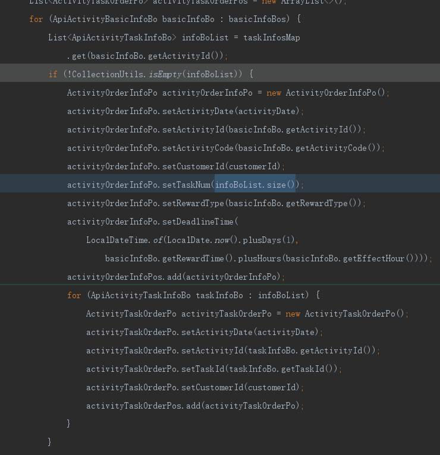
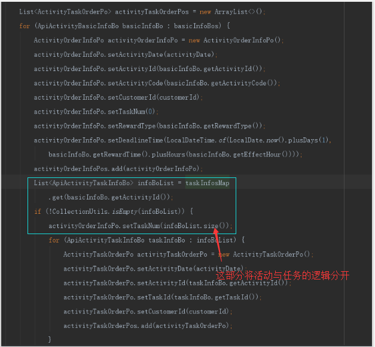
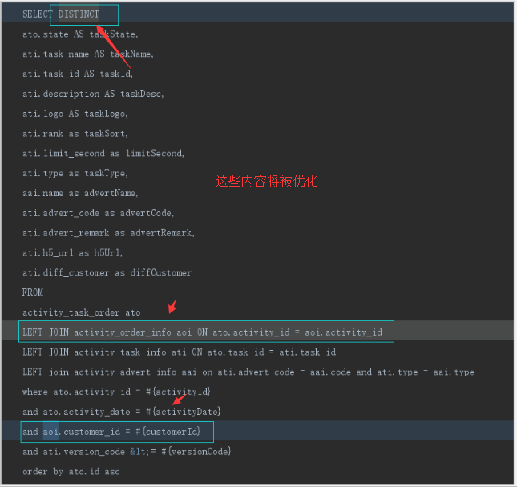
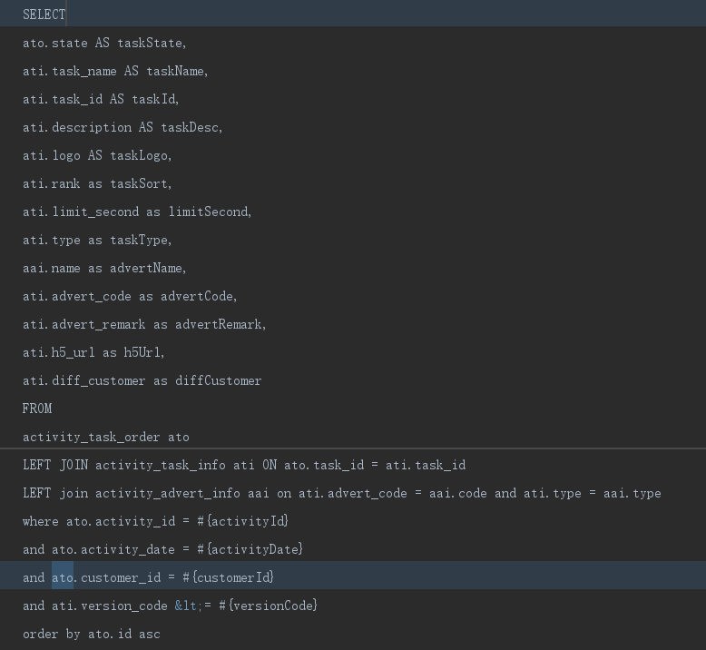
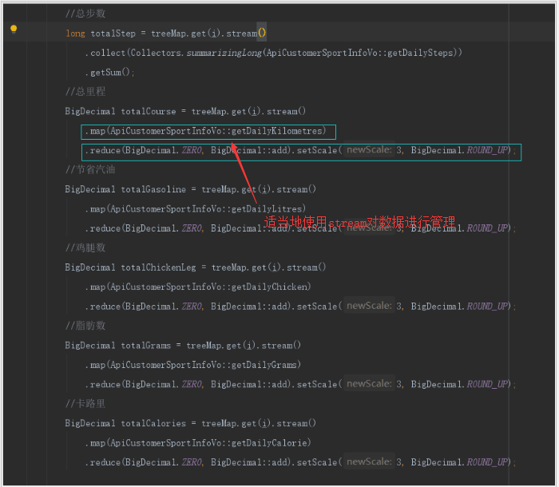
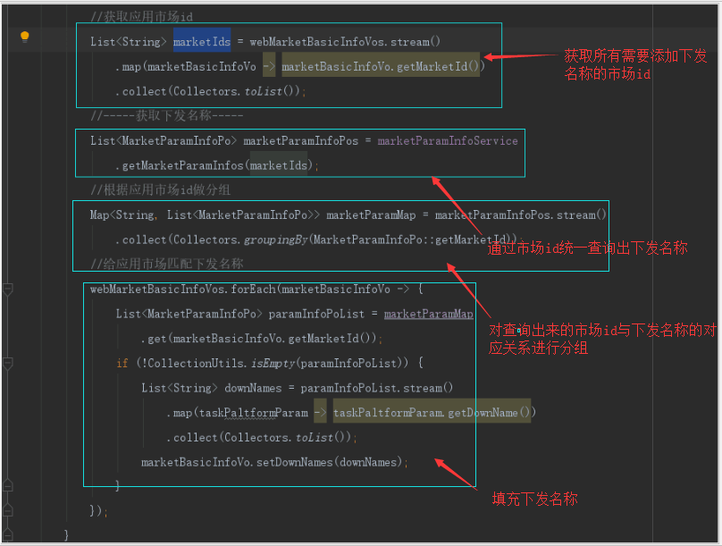

# CodeReview

2019年09月09日 16:00:00 胡海清

## **代码逻辑的规范性**

### **更改前：**

### **更改后：**

#### 通过这两张图对比可以明显看到：第二张图处代码更规范、出错情况更小,比如：

1. 图二中的代码逻辑较为集中，活动为活动，任务为任务
2. 即便任务没有但是活动也可以有

## **业务代码需要考虑的点**

### **更改前：**

### **更改后：**

#### 通过两张图可以明显看到：第二张图代码更规范、更符合业务逻辑

#### 注意：

1. 将distinct去掉了、该列表主要是查询，如果人为的对查询结果进行干涉，将导致查询结果出错，也就可能出现业务流程行不通的情况
2. 将第一个left join 去除，该业务流程过程中不需要对活动订单再确认，原流程定义便是有活动订单的才可能有活动任务订单
3. 表设计本身：activity\_task\_order:activity\_id映射activity\_order\_info:activity\_id为多对一，但是activity\_id在activity\_order\_info表里面不是唯一的,

   这就存在每activity\_task\_order:activity\_id映射到多条activity\_order\_info，如此将导致结果出错；同样的若以activity\_order\_info映射activity\_task\_order也存在这种情况；

   除非两表都加上activity\_date做限制才能唯一。后面对表做了改动，两表都增加customer\_id\(虽然冗余，但是效果好\)，查询时去除activity\_order\_info表

## **java8中stream的妙用**

### **更改前：**

### **更改后：**

#### 通过这两张图明显可以看到：两张图都使用了java8的stream，使用stream可以简化统计、简化查询，

1. 第一张图罗列了stream的一般使用；
2. 第二张图结合stream的map分组，减少了查询数据库的次数（规定不能通过mapper映射解决，也不能在for循环中多次查询）；

   解析：统计需要获取下发名称的应用市场id， 然后一次性将所有下发名称相关对象查询出来， 并按照应用市场id做分组，最后在应用市场列表的for循环中补全下发名称

## 总结：业务代码编写过程中需要注意的一些限制：

1. 既然是业务代码那么必须严格按照业务流程走，完成本流程允许以及操作范围内的逻辑
2. 代码必须规范简洁明了，即方便团队代码管理，又利于review
3. 避免在for循环体内操作数据库，但可以适当的使用java8的stream，如：示例三，

   便于简化代码，增加逻辑性、可用性、简洁性

4. 减少foreach流的使用，避免在循环的过程中出现错误无法定位

