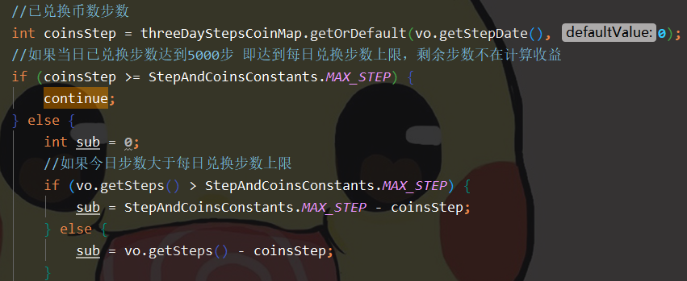
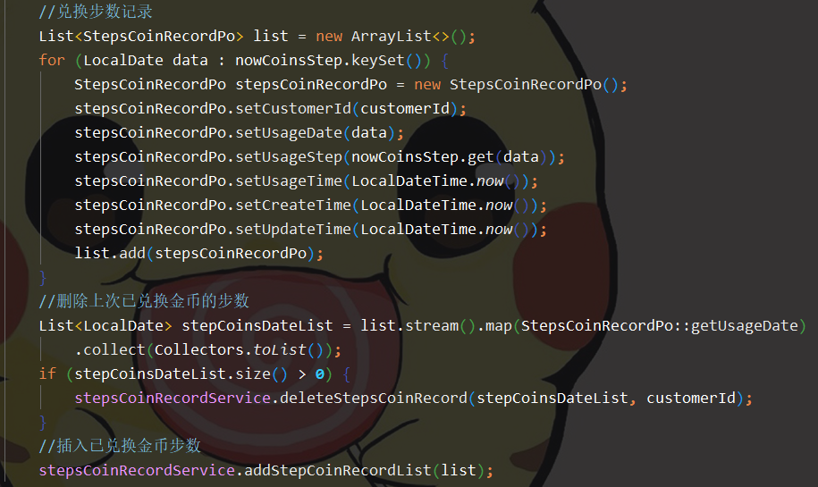
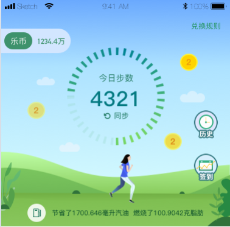
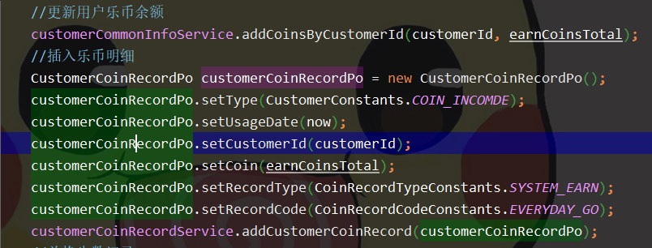

# 新乐走-运动收益

2019年7月8日10:06:15 胡韵

## 1.乐币兑换规则

1. 乐币兑换的步数上限为&lt;=5000步\[兑换乐币数为5.0个\]
2. 乐币兑换的步数下限为&gt;=100步\[兑换乐币数为0.1个\]

   **2.乐币计算流程**

3. 读取用户日常步数数据表中最近三天的步数数据
4. 读取步数兑换金币记录的数据表,查询出用户在最近三天已兑乐币的步数
5. 判断用户已兑换金币步数是否&gt;=5000步。若条件成立则用户新运动的步数不在进行乐币兑换计算,把用户最新的步数插入到已兑换乐币步数信息表,该表每日仅保留一条兑换记录且是用户最新操作记录
6. 若用户已兑换步数&lt;=5000步。将用户最新步数减去已兑换乐币步数后计算用户运动的步数所能兑换的金币数
7. 在条件4的情况下还需判断用户当日运动步数和兑换乐币步数的大小关系
8. 若当日用户运动步数&lt;5000步则计算用户可兑换乐币步数为用户运动步数减去已兑换步数
9. 若当日用户运动步数&gt;=5000步则计算用户可兑换乐币步数为乐币兑换步数上限减去已兑换步数

## 3.领取乐币流程

1. 经过过程2的计算,用户点击领取。先更新用户的可用乐币余额,在插入乐币明细

## 4.并发产生

1. app首页展示乐币最多为3个,用户会认为需要点击3次。
2. 网络不好的情况下,用户多次点击首页的乐币。

