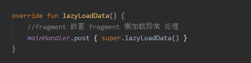
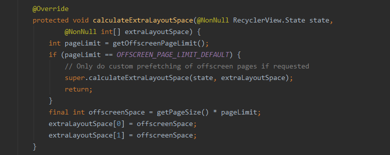

# Fragment在Androidx前后两种懒加载方式
2021年4月13日 15:15:58 邓强

## Fragment实现懒加载的必要性
一般页面都是一Activity+多Fragment的方式实现,默认情况下Fragment没有对用户显示的时候也是可以请求网络数据渲染页面的,
如果Fragment不进行优化处理,特别是从网络获取数据这种比较耗时的操作，那么就会造成流量和资源的浪费,影响App性能,启动速
度慢,用户体验不佳等

##老方案:ViewPager+Fragment
viewpager会通过setOffscreenPageLimit来设置预加载的项目,不设置setOffscreenPageLimit,则默认为1,始终会同时加载缓存两个
Fragment,而为了避免Fragment的频繁创建和销毁,一般ViewPager都会设置setOffscreenPageLimit为Fragment的数量,这样就会造成显示
一个Fragment的时候会加载所有Fragment数据.Androidx之前的老方案可用通过Frgament的setUserVisibleHint()的方法,来进行懒加载处
理,这个方法表示当前Fragment对用户是否可见,在可见、视图已加载完成并且没有加载过数据的时候才去加载,这样就实现Fragment的懒加载,

这种方式在Fragment嵌套中就会有问题了,子Fragment没有对用户显示的时候setUserVisibleHint()会先返回true,之后再返回false,如果要
达到上诉目的,就要去新增很多判断,对这种情况我只是简单的处理了一下,延迟处理懒加载方案,当然这种方法感觉很不雅观,又会觉得有隐藏的
问题. 

针对主页Fragment,这种方式还有一个很大的弊端,因为要保证Fragment不被销毁,就必须设置setOffscreenPageLimit为Fragment的数量,来缓存
Fragment,这样在进入App时所有的Fragment都会inflate解析XML布局,如果每个Frgament的页面布局都很复杂,那么就会影响App进入主页的速度,
这也是我所一直遇到的问题,一直没有什么好的解决方案,如果不设置setOffscreenPageLimit,在ViewPager的Adapter中复写destroyItem方法,注
释掉super方法,这样也可以达到Fragment不被销毁的目的,但是如果App长期处于后台状态,再次打开App时,如果不是重新启动,那么这个时候的Fragment
就有很多异常,View直接空白或者卡顿等等.其实也有一种解决方案,那就是配合ViewStub懒加载布局去实现,只有当Fragment对用户显示的时候才去加载
布局,但是我没有用这种方案,一是:对代码改动比较大 二是:有新的更简单的方案代替.那就是Androidx下的ViewPager2

##新方案:Androidx下的懒加载
虽然之前的方法可以有效实现Fragment的懒加载,但是有一个很大的问题,就是没有对用户显示的Fragment也会走生命周期onResume()方法,
那么既然走了onResume()方法,难道不是当前Fragment可以和用户进行交互吗?而老方案的情况就是既是不可见,又是可交互状态,如果我要在
onResume()处理一些逻辑,就需要加各种判断,而且针对嵌套的Fragment又会有新问题.而且Androix下Google已经弃用了上面的方法.
所以Google基于此问题在Androidx的FragmentTransaction中增加了setMaxLifecycle方法来控制Fragment所能调用的最大的生命周期函数
针对那些不可见的Fragment可走的最大生命周期可以设置为onStart(),而可见的Fragment可以走到onResume(),这样就可以通过Fragment的
onResume()方法来判断实现Fragment的懒加载

使用Viewpager2来代替ViewPager,它是基于RecyclerView实现的,可以解决预加载问题.ViewPager2默认情况下不会像ViewPager那样预先加
载出两侧的Fragment,因为vp2的setOffscreenPageLimit()默认为-1.
在vp2的内部类LinearLayoutManagerImpl中有一个calculateExtraLayoutSpace方法,通过设置它可以用来加载额外的布局空间.获取设置的
limit,如果默认没有设置就是-1,直接走父类方法,不用设置额外的布局空间.如果大于1,就会设置左右(或上下)额外的布局空间,就相当于预加
载了两边的Fragment

针对ViewPager2的情况下,保存Fragment不被销毁也可用通过设置setOffscreenPageLimit来实现,但是会导致同样的问题:所有的Fragment都会inflate解析XML布局
ViewPager2是基于RecyclerView实现的,所以可以通过设置RecyclerView的缓存池setItemViewCacheSize(),来保存Fragment不被销毁,这样也不会导致Fragment的xml布局同时加载.
设置View缓存池:(viewPager.getChildAt(0) as RecyclerView).setItemViewCacheSize(5)
