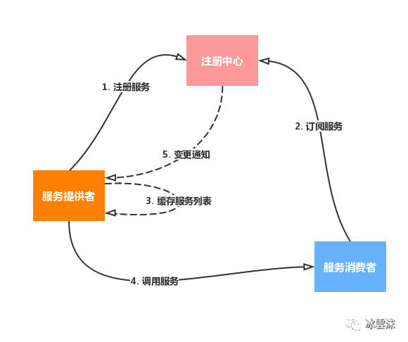

# Consul简介

2019年04月19日 13:30:00 刘晓伟

## 一、为什么有服务注册发现？

### 1.1 不使用服务注册发现


图中，客户端的一个接口，需要调用服务A-N。 客户端要知道服务的网络位置，往往是需要将配置存放在配置文件或数据库。 这里就带出几个问题：

* 需要配置N个服务的网络位置，加大配置的复杂性
* 服务的网络位置变化，都需要改变每个调用者的配置
* 集群的情况下，难以做负载（反向代理的方式除外）

### 1.2 使用服务注册发现


服务A-N把当前自己的网络位置注册到服务发现模块（这里注册的意思就是告诉，  
服务发现就以K-V的方式记录下，K一般是服务名，V就是IP:PORT。  
服务发现模块定时的轮询查看这些服务能不能访问的了（健康检查）。  
客户端在调用服务A-N的时候，就跑去服务发现模块问下它们的网络位置,然后再调用它们的服务。 这样的方式是不是就可以解决上面的问题了呢？ 客户端完全不需要记录这些服务网络位置，客户端和服务端完全解耦！

### 1.3 一个较为完整的服务注册与发现流程



## 二、Consul 介绍

### 2.1 Consul是分布式的、高可用、横向扩展的。consul提供的一些关键特性：

* service discovery：consul通过DNS或者HTTP接口使服务注册和服务发现变的很容易，一些外部服务，例如saas提供的也可以一样注册。
* health checking：健康检测使consul可以快速的告警在集群中的操作。和服务发现的集成，可以防止服务转发到故障的服务上面。
* key/value storage：一个用来存储动态配置的系统。提供简单的HTTP接口，可以在任何地方操作。
* multi-datacenter：无需复杂的配置，即可支持任意数量的区域。
* Raft： [Raft算法](http://thesecretlivesofdata.com/raft/)来实现分布式一致性

  **2.2 Consul多数据中心集群示例**


2.2.1上图是官网提供的一个事例系统图，图中的Server是consul服务端高可用集群，Client是consul客户端。 consul客户端不保存数据，客户端将接收到的请求转发给响应的Server端。 Server之间通过局域网或广域网通信实现数据一致性。 每个Server或Client都是一个consul agent。

2.2.2 Consul集群间使用了GOSSIP协议通信和raft一致性算法。上面这张图涉及到了很多术语：

* Agent——agent是一直运行在Consul集群中每个成员上的守护进程。通过运行consul agent来启动。agent可以运行在client或者server模式。指定节点作为client或者server是非常简单的，除非有其他agent实例。所有的agent都能运行DNS或者HTTP接口，并负责运行时检查和保持服务同步。
* Client——一个Client是一个转发所有RPC到server的代理。这个client是相对无状态的。client唯一执行的后台活动是加入LAN gossip池。这有一个最低的资源开销并且仅消耗少量的网络带宽。
* Server——一个server是一个有一组扩展功能的代理，这些功能包括参与Raft选举，维护集群状态，响应RPC查询，与其他数据中心交互WAN gossip和转发查询给leader或者远程数据中心。
* DataCenter——虽然数据中心的定义是显而易见的，但是有一些细微的细节必须考虑。例如，在EC2中，多个可用区域被认为组成一个数据中心。我们定义数据中心为一个私有的，低延迟和高带宽的一个网络环境。这不包括访问公共网络，但是对于我们而言，同一个EC2中的多个可用区域可以被认为是一个数据中心的一部分。
* Consensus——一致性，使用Consensus来表明就leader选举和事务的顺序达成一致。为了以容错方式达成一致，一般有超过半数一致则可以认为整体一致。Consul使用Raft实现一致性，进行leader选举，在consul中的使用bootstrap时，可以进行自选，其他server加入进来后bootstrap就可以取消。
* Gossip——Consul建立在Serf的基础之上，它提供了一个用于多播目的的完整的gossip协议。Serf提供成员关系，故障检测和事件广播。Serf是去中心化的服务发现和编制的解决方案，节点失败侦测与发现，具有容错、轻量、高可用的特点。
* LAN Gossip——它包含所有位于同一个局域网或者数据中心的所有节点。
* WAN Gossip——它只包含Server。这些server主要分布在不同的数据中心并且通常通过因特网或者广域网通信。
* RPC——远程过程调用。这是一个允许client请求server的请求/响应机制。

2.2.3 在每个数据中心，client和server是混合的。一般建议有3-5台server。这是基于有故障情况下的可用性和性能之间的权衡结果，因为越多的机器加入达成共识越慢。然而，并不限制client的数量，它们可以很容易的扩展到数千或者数万台。

2.2.4 同一个数据中心的所有节点都必须加入gossip协议。这意味着gossip协议包含一个给定数据中心的所有节点。这服务于几个目的：第一，不需要在client上配置server地址。发现都是自动完成的。第二，检测节点故障的工作不是放在server上，而是分布式的。这是的故障检测相比心跳机制有更高的可扩展性。第三：它用来作为一个消息层来通知事件，比如leader选举发生时。

2.2.5 每个数据中心的server都是Raft节点集合的一部分。这意味着它们一起工作并选出一个leader，一个有额外工作的server。leader负责处理所有的查询和事务。作为一致性协议的一部分，事务也必须被复制到所有其他的节点。因为这一要求，当一个非leader得server收到一个RPC请求时，它将请求转发给集群leader。

2.2.6 server节点也作为WAN gossip Pool的一部分。这个Pool不同于LAN Pool，因为它是为了优化互联网更高的延迟，并且它只包含其他Consul server节点。这个Pool的目的是为了允许数据中心能够以low-touch的方式发现彼此。这使得一个新的数据中心可以很容易的加入现存的WAN gossip。因为server都运行在这个pool中，它也支持跨数据中心请求。当一个server收到来自另一个数据中心的请求时，它随即转发给正确数据中想一个server。该server再转发给本地leader。 这使得数据中心之间只有一个很低的耦合，但是由于故障检测，连接缓存和复用，跨数据中心的请求都是相对快速和可靠的。

## 三、使用docker部署Consul

### 3.1 docker环境部署

```text
setenforce 0
sed --follow-symlinks -i "s/SELINUX=enforcing/SELINUX=disabled/g" /etc/selinux/config
yum install docker
systemctl enable docker && systemctl start docker
firewall-cmd --set-default-zone=trusted
firewall-cmd --complete-reload
```

### 3.2 Consul集群部署

* 节点1  leader

  ```text
  docker run  --net=host --name consul  \
  -v /data/consul_data/data:/consul/data    \
  -v /data/consul_data/conf:/consul/config   \
  -d docker.io/consul consul agent -server -ui -client=0.0.0.0 \
  -bind=192.168.1.60        \
  -bootstrap-expect=3    \
  -data-dir /consul/data   \
  -config-dir /consul/config
  ```

* 节点2

  ```text
  docker run  --net=host --name consul  \
  -v /data/consul_data/data:/consul/data    \
  -v /data/consul_data/conf:/consul/config   \
  -d docker.io/consul consul agent -server  -ui  -client=0.0.0.0 \
  -bind=192.168.1.59        \
  -bootstrap-expect=3    \
  -data-dir /consul/data   \
  -config-dir /consul/config   \
  -join 192.168.1.60
  ```

* 节点3

  ```text
  docker run  --net=host --name consul  \
  -v /data/consul_data/data:/consul/data    \
  -v /data/consul_data/conf:/consul/config   \
  -d docker.io/consul consul agent -server -ui  -client=0.0.0.0 \
  -bind=192.168.1.72        \
  -bootstrap-expect=3    \
  -data-dir /consul/data   \
  -config-dir /consul/config   \
  -join 192.168.1.60
  ```

  **3.3 Consul常用命令+常用选项**

  ```text
  -bind：该地址用来在集群内部的通讯，集群内的所有节点到地址都必须是可达的，默认是0.0.0.0。
  -client：consul绑定在哪个client地址上，这个地址提供HTTP、DNS、RPC等服务，默认是127.0.0.1。
  -node consul节点ID，集群内唯一
  -join  192.168.1.60   节点加入集群(leader 192.168.1.60)
  -server agent启用server模式运行。不加入此参数则client模式运行。
  -ui   启用web管理页面
  -data-dir  指定agent储存状态的数据目录
  ```

  **3.4 Consul集群状态检查**

  ```text
  docker exec -it consul /bin/sh
  consul operator raft list-peers
  consul members
  ```

## 四、Spring Cloud Consul

### 4.1服务发现与Consul

服务发现是基于微服务架构的关键原则之一。尝试配置每个客户端或某种形式的约定可能非常困难,可以非常脆弱。  
Consul通过HTTP API和DNS提供服务发现服务。Spring Cloud Consul利用HTTP API进行服务注册和发现。

### 4.2 注册Consul

当客户端注册Consul时，它提供有关自身的元数据，如主机和端口，ID，名称和标签。默认情况下，将创建一个HTTP 检查，  
每隔10秒Consul命中/health端点。如果健康检查失败，则服务实例被标记为关键。

### 4.3 HTTP健康检查

Consul实例的运行状况检查默认为“/actuator/health”，它是Spring Boot Actuator应用程序中有用端点的默认位置。

### 4.4 springcloud2.0集成consul注册发现

\(1\)服务依赖

```text
<dependency>
  <groupId>org.springframework.cloud</groupId>
  <artifactId>spring-cloud-starter-consul-discovery</artifactId>
</dependency>
<dependency>
  <groupId>org.springframework.boot</groupId>
  <artifactId>spring-boot-starter-actuator</artifactId>
</dependency>
```

\(2\) application.yml

```text
server.port: 9093
spring:
  application:
    name: project37
  cloud:
    consul:
      host: 192.168.1.60
      port: 8500
      discovery:
        register: true
#        hostname: 192.168.1.58
        prefer-ip-address: true
        serviceName: ${spring.application.name}
        instanceId: ${spring.application.name}:${vcap.application.instance_id:${spring.application.instance_id:${random.value}}}
#        instanceId: ${spring.application.name}:${spring.cloud.client.ip-address}:${server.port}
##        check服务端点
        healthCheckPath: /actuator/health
##        check检查时间间隔
        healthCheckInterval: 30s
#        健康检查超时时间
        healthCheckTimeout: 5s
#        check失败后，多少秒删除本服务
        healthCheckCriticalTimeout: 1s
#        心跳检查，ttl为主动上报时间间隔，超时consul会将服务标记为失效
        heartbeat:
          enabled: true
          ttl-unit: s
          ttl-value: 2
#    多网卡时，指定注册服务网段
    inetutils:
      preferred-networks:
      - ^192\.168
```

## 五、其他

### 5.1 链接推荐

* [Consul官方文档](https://www.consul.io/docs/internals/index.html)
* [Consul入门教程](https://www.cnblogs.com/xiaohanlin/p/8016803.html)            
* [Consul集群原理动画演示\(raft\)](http://thesecretlivesofdata.com/raft/)  
* [Consul实现原理系列文章1: 使用Raft算法实现分布式一致性](https://blog.csdn.net/u012422829/article/details/77803799)
* [服务发现的基本原理与比较: Eureka vs Consul vs Zookeeper](https://www.jianshu.com/p/086f8066188b) 
* [命令行方式部署Consul集群](https://www.hi-linux.com/posts/28048.html#构建consul集群)
* [consul常用命令+常用选项](https://www.cnblogs.com/java-zhao/p/5378876.html)
* [docker-consul](https://www.cnblogs.com/hutao722/p/9668202.html)
* [Spring Cloud Consul](https://springcloud.cc/spring-cloud-consul.html)
* [spring cloud consul使用ip注册服务的方法示例](https://www.jb51.net/article/157884.htm)

