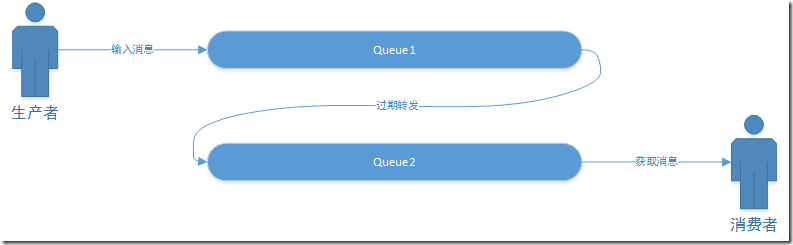
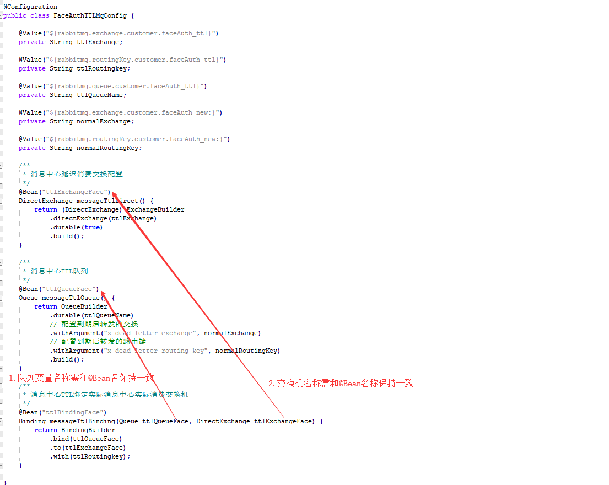
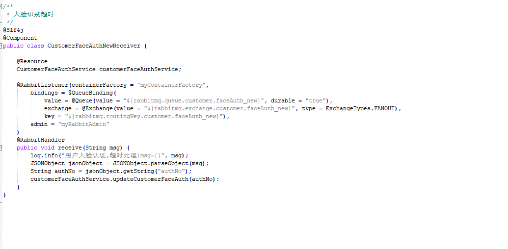
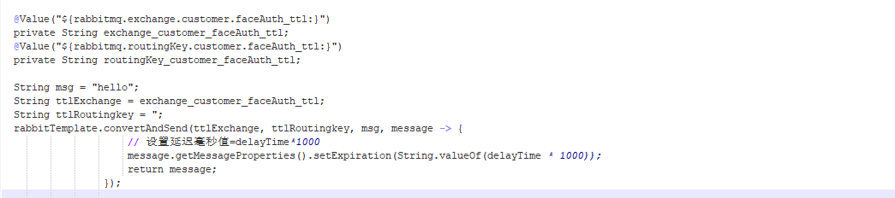

# RabbitMQ延迟消息发送原理
2019年07月25日 13:30:00 刘晓伟

## 1.背景

* 场景一：物联网系统经常会遇到向终端下发命令，如果命令一段时间没有应答，就需要设置成超时。

* 场景二：订单下单之后30分钟后，如果用户没有付钱，则系统自动取消订单。

## 2.解决方案

* 最常用的方法是定期轮训数据库，设置状态。（在数据量小的时候并没有什么大的问题）。
* 基于优先级队列的JDK延迟队列，时间轮。
* 选择RabbitMQ来实现（减轻数据库轮训压力）。

## 3.RabbitMQ实现延迟队列重要概念

### 3.1 消息的TTL
消息的TTL就是消息的存活时间。RabbitMQ可以对队列和消息分别设置TTL。
对队列设置就是队列没有消费者连着的保留时间，也可以对每一个单独的消息做单独的设置。
超过了这个时间，我们认为这个消息就死了，称之为死信。
如果队列设置了，消息也设置了，那么会取小的。
所以一个消息如果被路由到不同的队列中，这个消息死亡的时间有可能不一样（不同的队列设置）。

### 3.2 死信Exchange
在队列上指定一个Exchange，则在该队列上发生如下情况:
1.消息被拒绝（basic.reject or basic.nack)，且requeue=false;
2.消息过期而被删除（TTL）;
3.消息数量超过队列最大限制而被删除;
4.消息总大小超过队列最大限制而被删除;

## 4.RabbitMQ实现延迟队列
### 4.1 实现延迟队列原理图



* 生产者输出消息到Queue1，并且这个消息是设置有有效时间的，比如60s。消息会在Queue1中等待60s，如果没有消费者收掉的话，
它就是被转发到Queue2，Queue2有消费者，收到，处理延迟任务。

* 延迟任务通过消息的TTL和Dead Letter Exchange来实现。我们需要建立2个队列，一个用于发送消息，
  一个用于消息过期后的转发目标队列。

### 4.2 实现延迟队列关键代码分析
#### 4.1  实现ttl消息自动转发关键配置

```
  x-dead-letter-exchange
  x-dead-letter-routing-key
```

#### 4.2 声明ttl队列和实际业务消费者队列



#### 4.3 监听实际业务消费者队列



#### 4.4 延迟消息发送


                 

## 五、注意事项
鉴于转发延迟消息的队列(ttl队列)，不按设置的延迟时间发送（rabbitmq bug）。
需要延迟发送消息的任务，都单独配置自己的ttl,自己消费自己的延迟消息 。

## 六、其他
### 6.1 链接推荐
* [RabbitMQ延迟消息发送原理分析](https://www.cnblogs.com/haoxinyue/p/6613706.html)
* [RabbitMQ延迟消息发送技术实现](https://www.jianshu.com/p/b74a14c7f31d)


