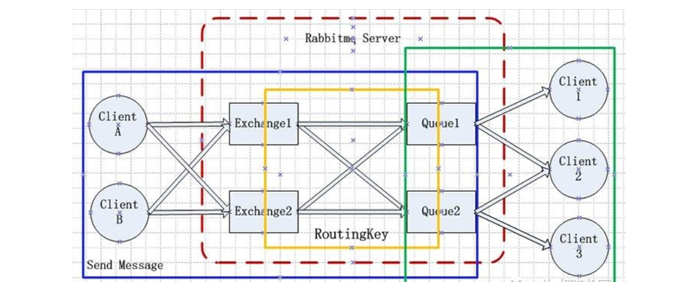
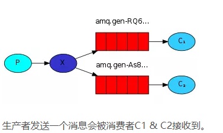
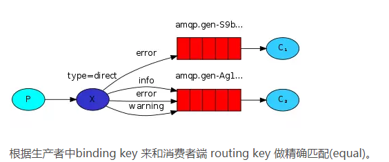
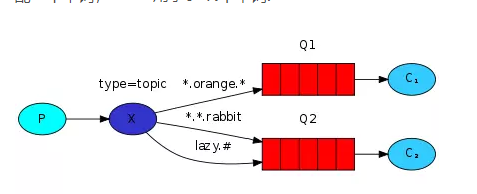
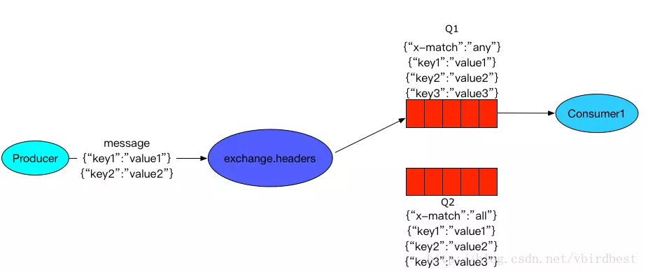
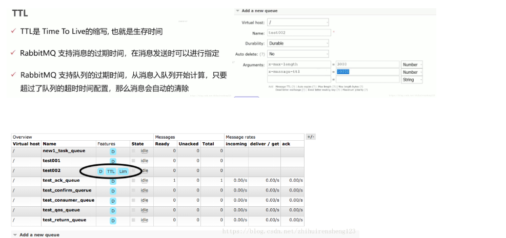
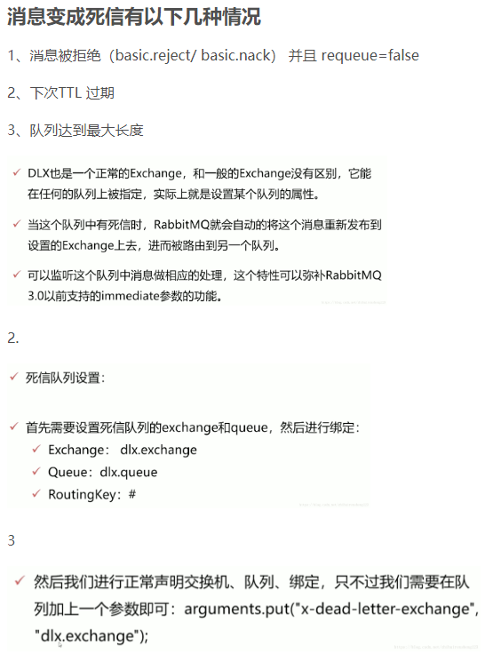
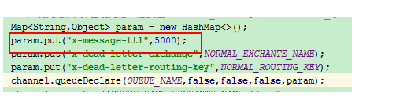
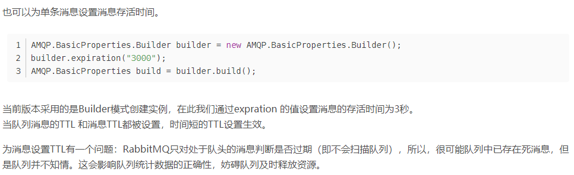

## rabbitMQ详解和实战
    2020年1月9日10:04:33 胡韵

## 1. rabbitMQ 是什么？ 
RabbitMQ是实现了高级消息队列协议（AMQP）的开源消息代理软件（亦称面向消息的中间件)。AMQP(Advanced Message Queuing Protocol) , 一个提供统一消息服务的应用层标准高级消息队列协议,是应用层协议的一个开放标准,为面向消息的中间件设计, RocketMQ,ActiveMQ， ZeroMQ, Kafaka, 等消息队列都是AMQP协议的实现。

## 2. rabbitMQ 名词解析
* **virtual host:** [类似DB中的schema, JAVA中的namespace]
* **exchange:**     [交换机，消费者发送消息到exchange]
* **routeintKey:**  [生产者在将消息发送给Exchange的时候，一般会指定一个routing key，来指定这个消息的路由规则，而这个routing key需要与Exchange Type及binding key联合使用才能最终生效。在Exchange Type与binding key固定的情况下（在正常使用时一般这些内容都是固定配置好的），我们的生产者就可以在发送消息给Exchange时， 通过指定routing key来决定消息流向哪里。RabbitMQ为routing key设定的长度限制为255 bytes]
* **queue:**        [队列用于储存消息]

## 3. Exchange Types(交换机类型)
* **fanout message：** 广播模式，fanout类型的Exchange路由规则非常简单，它会把所有发送到该Exchange的消息路由到所有与它绑定的Queue中，所以不管你的生产者端的bingding key 和 消费者端的routing key。

* **direct message：** direct类型的Exchange路由规则也很简单，它会把消息路由到那些binding key与routing key完全匹配的Queue中, routing(binding) key 最大长度 255 bytes

* **topic message：** direct message 是 binding key == routing key, topic message是like, 其中routing key中可以带 * 和 # 来做模糊匹配， “*”用于匹配一个单词，“#”用于0~N个单词.
* key.# 能够匹配到 key.123.234.345.456  
* key.* 只能匹配到 key.123

* **headers message：** headers类型的Exchange不依赖于routing key与binding key的匹配规则来路由消息，而是根据发送的消息内容中的headers属性进行匹配。

## 4.延时消息(多情景)
* **TTL:** 

* **死信队列:** 死信队列：DLX, Dead-letter-Exchange;利用DLX ,当消息在一个队列中变成死信(dead message) 之后， 他能被冲新publish到另一个Exchange, 这个exchange 就是DLX

### 4.1 实现方式一：给队列设置消息过期时间
* 只要给队列设置x-message-ttl 参数，就设定了该队列所有消息的存活时间，时间单位是毫秒，值必须大于等于0
RabbitMQ保证死消息（在队列中的时间超过设定的TTL时间）不会被消费者获得，同时会尽快删除死的消费者。
消息不会在消费者的缓冲区中过期，也就是说，只要队列在消息过期前将消息推送给消费者，消费者就一定能处理到这条消息。
重新入队（例如被取消确认或者信道关闭或拒绝并重新入队）的消息的过期时间保留初始值，即不刷新过期时间。

### 4.2 实现方式二：为单条消息设置TTL
* **Message设置过期时间：**

* 虽然 consumer 从来看不到过期的 message ，但是在过期 message 到达 queue 的头部时确实会被真正的丢弃（或者 dead-lettered ）。当对每一个 queue 设置了 TTL 值时不会产生任何问题，因为过期的 message 总是会出现在 queue 的头部。当对每一条 message 设置了 TTL 时，过期的 message 可能会排队于未过期 message 的后面，直到这些消息被 consume 到或者过期了。在这种情况下，这些过期的 message 使用的资源将不会被释放，且会在 queue 统计信息中被计算进去（例如，queue 中存在的 message 的数量）。
对于第一种设置队列TTL属性的方法，一旦消息过期，就会从队列中抹去，而第二种方法里，即使消息过期，也不会马上从队列中抹去，因为每条消息是否过期时在即将投递到消费者之前判定的，为什么两者得处理方法不一致？因为第一种方法里，队列中已过期的消息肯定在队列头部，RabbitMQ只要定期从队头开始扫描是否有过期消息即可，而第二种方法里，每条消息的过期时间不同，如果要删除所有过期消息，势必要扫描整个队列，所以不如等到此消息即将被消费时再判定是否过期，如果过期，再进行删除。

## 五、参考资料
* [rabbitMQ官网](https:././www.rabbitmq.com./getstarted.html)
* [RabbitMQ消息超时时间、队列消息超时时间、队列超时时间](https:././blog.csdn.net./liu0808./article./details./81356552)
* [RabbitMQ（三）RabbitMQ消息过期时间（TTL）](https:././blog.csdn.net./jiao_fuyou./article./details./22053663)

