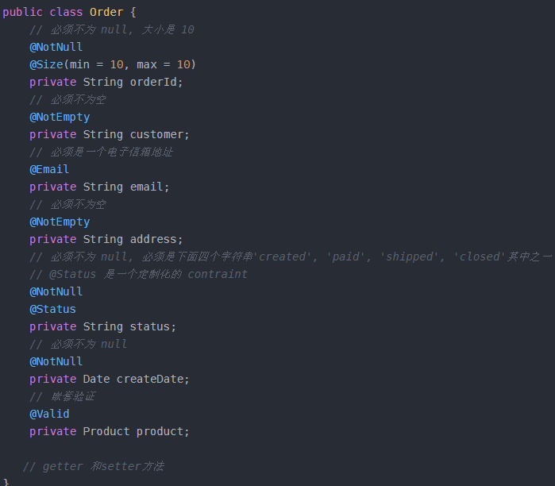
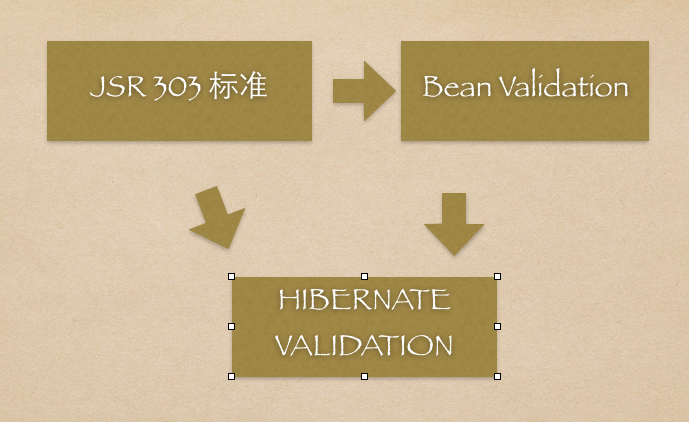
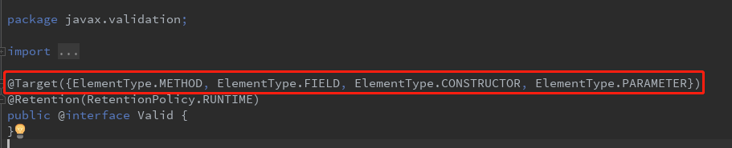
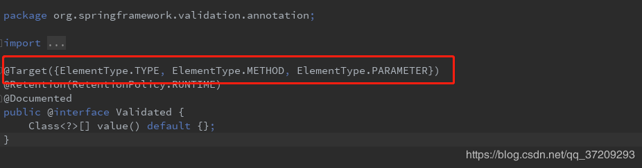

# 使用validator对JavaBean进行输入校验 
2019年6月5日10:06:15 胡韵
##  Hibernate Validator校验
### JSR-303简介
  + JSR-303是 JAVAEE6中的一项子规范，叫做 BeanValidation，官方参考实现是HibernateValidator。
  + JSR 303 用于对 Java Bean 中的字段的值进行验证。Spring MVC 3.x 之中也大力支持 JSR-303，可以在控制器中对表单提交的数据方便地验证。
  + hibernate-validator-4.2.0.Final.jar是对上述接口的实现。
### JSR-303基本的校验规则
 + 空检查
   - @Null 验证对象是否为null
   - @NotNull 验证对象是否不为null, 无法查检长度为0的字符串 
   - @NotBlank 检查约束字符串是不是Null还有被Trim的长度是否大于0,只对字符串,且会去掉前后空格
   - @NotEmpty 检查约束元素是否为NULL或者是EMPTY
 + Boolean检查 
   - @AssertTrue 验证 Boolean 对象是否为 true
   - @AssertFalse 验证 Boolean 对象是否为 false
 + 长度检查 
   - @Size(min=, max=) 验证对象（Array,Collection,Map,String）长度是否在给定的范围之内 
   - @Length(min=, max=) Validates that the annotated string is between min and max included.
 + 日期检查 
   - @Past 验证 Date 和 Calendar 对象是否在当前时间之前，验证成立的话被注释的元素一定是一个过去的日期 
   - @Future 验证 Date 和 Calendar 对象是否在当前时间之后 ，验证成立的话被注释的元素一定是一个将来的日期 
   - @Pattern 验证 String 对象是否符合正则表达式的规则，被注释的元素符合制定的正则表达式，regexp:正则表达式 flags: 指定 Pattern.Flag 的数组，表示正则表达式的相关选项。
 + 数值检查 
   - 建议使用在String,Integer类型，不建议使用在int类型上，因为表单值为""时无法转换为int，但可以转换为String为"",Integer为null 
   - @Min 验证 Number 和 String 对象是否大等于指定的值
   - @Max 验证 Number 和 String 对象是否小等于指定的值
   - @DecimalMax 被标注的值必须不大于约束中指定的最大值. 这个约束的参数是一个通过BigDecimal定义的最大值的字符串表示.小数存在精度
   - @DecimalMin 被标注的值必须不小于约束中指定的最小值. 这个约束的参数是一个通过BigDecimal定义的最小值的字符串表示.小数存在精度 
   - @Digits 验证 Number 和 String 的构成是否合法 
   - @Digits(integer=,fraction=) 验证字符串是否是符合指定格式的数字，interger指定整数精度，fraction指定小数精度。 
   - @Range(min=, max=) 被指定的元素必须在合适的范围内 
   - @Range(min=10000,max=50000,message=”range.bean.wage”) 
   - @Valid 递归的对关联对象进行校验, 如果关联对象是个集合或者数组,那么对其中的元素进行递归校验,如果是一个map,则对其中的值部分进行校验.(是否进行递归验证) 
   - @CreditCardNumber信用卡验证 
   - @Email 验证是否是邮件地址，如果为null,不进行验证，算通过验证。 
   - @ScriptAssert(lang= ,script=, alias=) 
   - @URL(protocol=,host=, port=,regexp=, flags=)
### 使用示例

### Bean Validation
  + HibernateValidator是BeanValidation的参考实现.HibernateValidator提供了JSR-303规范中所有内置constraint的实现，除此之外还有一些附加的constraint。
  + validation bean 是基于JSR-303标准开发出来的，使用注解方式实现，及其方便，但是这只是一个接口，没有具体实现.Hibernate Validator是一个hibernate独立的包，可以直接引用，他实现了validation bean同时有做了扩展，比较强大(实现原理如图)。

### @Validated与@Valid
  + Spring Validation验证框架对参数的验证机制提供了@Validated（Spring's JSR-303规范，是标准JSR-303的一个变种），javax提供了@Valid（标准JSR-303规范），配合BindingResult可以直接提供参数验证结果。
  + 检验Controller入参规范时，@Validated和@Valid在基本验证功能上没有太多区别。但在分组、注解地方、嵌套验证等功能上有所不同。
  + 分组：@Validated：提供分组功能，可以在入参验证时，根据不同的分组采用不同的验证机制。@Valid：没有分组功能。
  + 注解：@Validated：用在类型、方法和方法参数上。但不能用于成员属性（field)。@Valid：可以用在方法、构造函数、方法参数和成员属性（field）上。
 

  

### 总结 javax.validation.constraints和Hibernate Validator
  + JSR-303是JavaEE6中的一项子规范，叫做BeanValidation，官方参考实现是hibernate-validator。
  + Validation-api只是一套标准，hibernate-validator实现了这套标准。
  + Spring-boot-starter-web会依赖hibernate-validator。
  
## 参照资料
* [JSR 303 - Bean Validation 介绍及最佳实践](https://www.ibm.com/developerworks/cn/java/j-lo-jsr303/index.html)
* [Hibernate Validator](http://www.hibernate.org/subprojects/validator.html)
* [JSR-303 数据校验学习（一）](https://blog.csdn.net/qq_28867949/article/details/78922520)
* [Hibernate Validator校验](https://www.liangzl.com/get-article-detail-15056.html)

 
 

 
